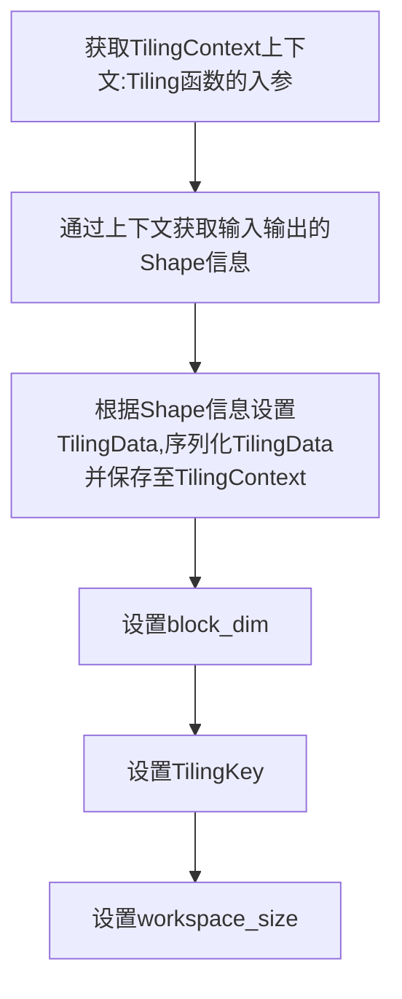

### Host与Device

- Host指与Device相连的X86服务器、ARM服务器，会利用Device提供的NN（Neural Network）计算能力完成任务
- Device模块指安装了昇腾AI处理器的硬件设备，利用PCIe接口与Host侧连接，提供NN计算能力

### 核函数

核函数（Kernel Function）是Ascend C算子device侧的入口。Ascend C允许用户使用核函数这种C/C++的语法扩展来运行device代码。用户在核函数中实现算子逻辑的编写，例如自定义算子类及其成员函数以实现该算子的所有功能。

**核函数**是直接在device侧执行的代码。在核函数中，需要为在一个核上执行的代码规定要进行的**数据访问**和**计算操作**，SPMD编程模型允许核函数调用时，多个核并行地执行同一个计算任务。

核函数是host侧和device侧连接的桥梁。

```C++
Ascend C __global__ __aicore__ void kernel_name(argument list);
CUDA __global__ void kernel_name(argument list);
```

### DaVinci Core


### AI Core的逻辑架构抽象

- 计算单元

  AI Core内异步计算过程（指令流）：

  ```mermaid
  graph TB
  标量计算单元:读取指令序列 --> 标量计算单元:发射指令到对应单元 --> 各处理单元:并行执行指令:数据搬运,向量计算,矩阵计算
  
  ```

  

- 存储单元

  - Local Memory: AI Core上的所有存储，这里的Local本地，指的是AI Core的内部；
  - Global Memory: 无论是DDR|HBM|L2 级缓存|内存，Global指AI Core外部的存储；

- 搬运单元

  AI Core内部搬运过程（数据流）：

  ```mermaid
  graph TB
  DMA:数据搬入LocalMem --> 计算单元:数据完成计算,回写LocalMem --> DMA:数据搬出到GlobalMem
  
  ```

### AI Core内部并行计算架构抽象

- 计算单元

  Scalar计算单元：执行地址计算、循环控制等标量计算工作，并把向量计算、矩阵计算、数据搬运、同步指令发射给对应单元执行

  Cube计算单元：负责执行矩阵计算

  Vector计算单元：负责执行向量计算
  
- 搬运单元

  负责在Global Memory和Local Memory之间搬运数据

  MTE1——数据在AI Core内部的流转

  MTE2——数据搬入单元

  MTE3——数据搬出单元

- 存储单元

  编程对象，数据主体

  外部存储：Global Memory

  ```C++
  void Init(__gm__ uint8 *__restrict__ src_gm, __gm__ uint8_t *__restrict__ dst_gm)
  {
    uint32_t dataSize = 256;
    GlobalTensor<int32_t> inputGlobal;// 类型为int32_t
    // 设置源操作数在Global Memory上的起始地址为src_gm,所占外部存储的大小为256个int32_t
    inputGlobal.SetGlobalBuffer(reinterpret_cast<__gm__ int32_t *>(src_gm), dataSize);
    
  }
  ```

  内部存储：Local Memory 

  ```C++
  template <typename T> class LocalTensor {
    T GetValue(const uint32_t offset) const; // 获取LocalTensor中的某个值，返回T类型的立即数。
    // 获取距原LocalTensor起始地址偏移量为offset的新LocalTensor，注意offset不能超过原有LocalTensor的size大小。offset单位为element
    LocalTensor operator[](const uint32_t offset) const;
    uint32_t GetSize() const; // 获取当前LocalTensor size大小
  }
  ```

  LocalTensor指代的是AI Core内部的存储，不同的流水任务之间存在数据依赖，需要进行数据传递。Ascend C中使用Queue队列完成任务之间的数据通信和同步，例如在Compute之前完成CopyIn的数据搬运。
### 逻辑位置

  | TPosition | 具体含义                                                     |
  | --------- | ------------------------------------------------------------ |
  | GM        | Global Memory，对应AI Core的外部存储                         |
  | VECIN     | 用于向量计算，搬入数据的存放位置，在数据搬入Vector计算单元时使用此位置 |
  | VECOUT    | 用于向量计算，搬出数据的存放位置，在将Vector计算单元结果搬出时使用此位置 |
  | A1        | 用于矩阵计算，存放整块A矩阵，可类比CPU多级缓存中的二级缓存   |
  | B1        | 用于矩阵计算，存放整块B矩阵，可类比CPU多级缓存中的二级缓存   |
  | A2        | 用于矩阵计算，存放切分后的小块A矩阵，可类比CPU多级缓存中的一级缓存 |
  | B2        | 用于矩阵计算，存放切分后的小块B矩阵，可类比CPU多级缓存中的一级缓存 |
  | CO1       | 用于矩阵计算，存放小块结果C矩阵，可理解为Cube Out            |
  | CO2       | 用于矩阵计算，存放整块结果C矩阵，可理解为Cube Out            |

 

### 开发流程

算子分析：分析算子的数学表达式、输入、输出以及计算逻辑的实现，明确需要调用的Ascend C接口。

- 明确算子的数学表达式及计算逻辑

  Add算子的数学表达式： $$z = x + y$$ ，计算逻辑：输入数据需要先搬入到片上存储，然后使用计算接口完成两个加法运算，得到最终结果，再搬出到外部存储

- 明确输入和输出
  
  Add算子有两个输入： $x$ 与 $$y$$ ，输出为$$z$$。输入数据类型为half，输出数据类型与输入数据类型相同。输入支持固定shape（8，2048），输出shape与输入shape相同。输入数据排布类型为ND。
  
- 确定核函数名称和参数

  自定义核函数名，如add_custom。

- 确定算子实现所需接口

  DataCopy实现

  Add双目实现

  使用到LocalTensor，使用Queue队列管理，会使用到EnQue，DeQue接口。

核函数定义：定义Ascend C算子入口函数

根据编程范式实现算子类：完成核函数的内部实现

### 编程范式

Ascend C编程范式把算子内部的处理程序，分成多个流水任务（Stage），以张量（Tensor）为数据载体，以队列（Queue）进行任务之间的通信同步，以内存管理模块（Pipe）管理任务间的通信内存。

### SPMD模型  

Ascend C算子编程是SPMD的编程，将需要处理的数据拆分并分布在多个计算核心上运行

多个AI Core共享相同的指令代码，每个核上的运行实例唯一的区别是block_idx不同

block的类似于进程，block_idx就是标识进程唯一性的进程ID，编程中使用函数GetBlockIdx()获取ID

###   流水任务

单核处理程序中主程序调度的并行任务。在核函数内部，可以通过流水任务实现数据的并行处理来提升性能。

### 矢量编程流水任务设计

矢量算子编程范式把算子的实现分为3个基本任务：CopyIn，Compute，CopyOut。

CopyIn，Compute任务间通过VECIN队列inQueueX，inQueueY进行通信和同步，Compute，CopyOut任务间通过VECOUT队列outQueueZ进行通信和同步。

pipe内存管理对象对任务间交互使用到的内存，临时变量使用到的内存统一进行管理。

```C++
class KernelAdd{
    public:
    	__aicore__ inline KernelAdd(){}
    	__aicore__ inline void Init(){}
    	__aicore__ inline void Process(){}
    private:
    	__aicore__ inline void CopyIn(){}
    	__aicore__ inline void Compute(){}
    	__aicore__ inline void CopyOut(){}
    private:
    	TPipe pipe;
    	TQue<QuePosition::VECIN, BUFFER_NUM> inQueueX, inQueueY;
    	TQue<QuePosition::VECOUT, BUFFER_NUM> outQueueZ;
    	GlobalTensor<half> xGm, yGm, xGm;
}

```


### Init()函数实现

使用多核并行计算，需要将数据切片，获取到每个核实际需要处理的在Global Memory上的内存偏移地址.

数据整体长度TOTAL_LENGTH为8 * 2048，平均分配到8个核上运行，每个核上处理的数据大小BLOCK_LENGTH为2048，block_idx为核的逻辑ID，x + block_idx * BLOCK_LENGTH，索引为block_idx的核的输入数据在Global Memory上的内存偏移地址。

对于单核处理数据（2048个数字进行进一步切分，一条向量计算指令，它的计算容量是有限的，Vector是256个字节），可以进行数据切块（Tiling），将数据切分成8块。切分后的每个数据再次切分成BUFFER_NUM=2块，可以开启double buffer,实现流水之间的并行。

单核需要处理的2048个数据切分成16块，每块TILE_LENGTH=128个数据。Pipe为inQueueX分配了BUFFER_NUM块大小为TILE_LENGTH * sizeof(half)个字节的内存块，每个内存块能容纳TILE_LENGTH=128个half类型数据。


### CopyIn()函数实现

### Compute()函数实现

### CopyOut()函数实现


### Host侧算子实现

host侧算子实现开发包括Tiling实现、Shape推导等函数实现、算子原型注册：

1. Tiling实现（TilingFunc），计算数据切分过程相关的参数，比如每次计算的数据量大小

   （Vector计算单元一次只能处理256Byte，Cube计算单元一次只能处理16 * 16矩阵的计算）

2. Shape推导等函数实现（InferShape），根据算子的输入张量描述、算子逻辑及算子属性，推理出算子的输出张量描述，包括张量的Shape、数据类型及数据排布格式等信息。这样算子在构图准备阶段就可以为所有的张量静态分配内存，避免动态内存分配带来的开销。

3. 算子原型注册（OpDef），除了上述函数的开发，还需要进行算子原型定义，原型定义描述了算子的输入输出，属性等信息以及算子在AI处理器上相关实现信息，算子原型注册会关联算子原型定义和上述Tiling实现、Shape推导等函数，将其组合成一个整体。

4. 算子类注册（OP_ADD）


### Tiling下发

大多数情况下，Local Memory的存储，无法完全容纳算子的输入与输出的所有数据，需要每次搬运一部分输入数据进行计算然后搬出，再搬运下一部分输入数据进行计算，直到得到完整的最终结果，这个数据切分，分块计算的过程称之为Tiling实现。

- 每次搬运的那一部分数据块，叫做Tiling块
- 根据算子中不同输入形状确定搬入基本块大小的相关算法，叫做Tiling算法（或Tiling策略）
- 承载Tiling策略信息的数据结构叫做Tiling结构体
- 算子中实现Tiling算法并将Tiling结构体下发给Kernel侧的函数（一般定义在host侧的host实现文件中），叫做Tiling函数（或Tiling Function）
- Tiling实现完成后，获取到的Tiling切分算法相关参数，会传递给kernel侧，用于指导并行数据的切分。由于Tiling实现中完成的均为标量计算，AI Core并不擅长，所以我们将其独立出来放在Host侧 CPU上进行。


### Tiling函数

- 定义完Tiling结构体之后，即可着手实现Tiling函数，即尝试根据算子输入输出的shape等信息推算出Tiling信息，保存到Tiling结构体中，下发给Kernel侧。
- Tiling函数的入参和出参是同一个对象，即TilingContext对象，Tiling结构体保存在这个对象中，运行时环境会自动将此对象从Host侧传递给Kernel侧。



根据数据的尺寸设置不同的TilingKey，来选择不同的Tiling策略，同时软件栈在编译的时候会选择对应TilingKey的代码进行编译，节约空间。

将Tiling塞到context中实际上调用的就是`tiling.SavetoBuffer`，这样device侧就可以拿到tiling信息了。

### Kernel侧使用Tiling信息

kernel侧需要接受Tiling信息时，核函数定义是这样的：

```C++
__global__ __aicore__ void add_custom(GM_ADDR x, GM_ADDR y, GM_ADDR z, GM_ADDR workspace, GM_ADDR tiling) {
    GET_TILING_DATA(tiling_data, tiling);
}
```

注意这里参数的顺序按照“输入、输出、workspace、tiling”的顺序排布，开发者不要调整其顺序。

用GET_TILING_DATA来拆箱，第一个参数“tiling_data”名字随便取。


workspace表示在Global Memory上申请的额外空间。

### Shape推导概述

根据输入Tensor得到输出Tensor就可以完成网络的运行，但在实际的网络模型生成过程中，会先进行Tensor Shape以及data type的推导。这样可以让我们在图执行之前，就知道Tensor的数据类型和形状，提前校验其正确性；

同时提前推理出算子的输出张量描述，包括张量的形状，数据类型以及数据排布格式等信息，算子构图准备阶段就可以为所有的张量静态分配内存，避免动态内存分配带来的开销。


### 开发环境

- 非昇腾AI设备

  代码开发、编译等不依赖昇腾设备的开发环境

- 昇腾AI设备

  支持代码开发和编译，同时可以运行应用程序或进行训练脚本的迁移、开发&调试

### 运行环境

- 昇腾AI设备

  支持代码开发和编译，同时可以运行应用程序或进行训练脚本的迁移、开发&调试

### CANN相关安装包解读

`Ascend-cann-toolkit_8.0.RC2.alpha002_linux_aarch64.run`其中，`Ascend`和`cann`是固定前缀，`toolkit`代表套件软件包，很多在特定场景下的工具包有单独的命名，如`Ascend-cann-nnrt_8.0.RC2.alpha002_linux_aarch64.run`，`nnrt`代表推理引擎，其他`nnae`、`kernels`代表深度学习引擎软件包和算子二进制安装包。
