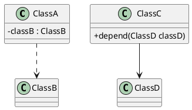

### Class Diagram
#### 需求分析

##### 基于用例（Use-Case)技术需求分析方法——识别Actor

示例：识别考勤卡系统的参与者

输入信息：（客户）所有参与工时的员工，系统维护人员

参与者识别：公司员工，考勤卡系统维护人员

输入信息：每半个月用一个Excel表格来记录，每个员工将他的工时表格，用电子邮件发给**我**。这个表格有固定的格式......

参与者识别：公司员工，考勤管理人员

输入信息：（客户）对考勤异常的员工，系统会实时发出异常提醒，定期会对全部考勤数据进行统计分析。

参与者识别：公司员工、考勤管理人员（隐含）、考勤分析人员（隐含）

##### 基于用例（Use-Case)技术需求分析方法——识别用例

- 识别用例（Use-Case)
  - 用例是系统执行的一系列动作，这些动作将生成特定参与者可观测的价值结果
  - 一个用例能表达从触发到完成有意义目标的完整的系统执行过程
  - 一个用例定义一组用例实例
- 关于用例的几点说明
  - Use Case不是需求片段
  - Use Case不是系统内部功能、模块
  - 用例可以是一个场景，包括动作和交互
  - 用例可以是一组场景，描述不同场景下的行为

##### 基于用例（Use-Case)技术需求分析方法——描述用例

- 前置、后置条件（状态，系统可检测）
  - 前置条件约束用例开始前系统的状态
  - 后置条件约束用例执行后系统的状态
  - 某些用例依赖于其他用例
  - 有助于识别漏掉的用例

考勤卡系统的用例描述

| **用例内容** | 内容解释                                | 写作举例                                                     |
| ------------ | --------------------------------------- | ------------------------------------------------------------ |
| 用例名称     | 给用例一个名称                          | 记录员工工时                                                 |
| 用例编号     | 便于管理                                | XXX.YYY.ZZZ.001                                              |
| 简要说明     | 用例的概要描述                          | 员工刷卡后自动记录工时                                       |
| Actor        | 用例的所有Actor                         | 员工                                                         |
| 前置条件     | 启动系统前，系统必须满足的条件          | 系统管理员已启动系统，前端显示界面                           |
| 最小保证     | 用例对系统的最低要求                    | 工时系统在PC上稳定运行，读卡器正常工作                       |
| 后置条件     | 用例完成后，系统输出或达到的状态        | 如果员工刷卡，则记录本次刷卡时间                             |
| 触发事件     | 启动用例的事件                          | 当员工刷卡时，触发用例                                       |
| 基本场景     | 完成用例目标需要的一系列基本动作        | 1. 员工刷卡，读卡器读取员工信息，输入到系统；2.系统获得刷卡时间，并将员工刷卡信息录入系统；3.系统将员工刷卡信息持久化；4.界面显示员工刷卡信息 |
| 扩展场景     | 非基本的成功场景和失败场景              | 1.员工不存在；2.如果员工刷卡方式不正确，导致读卡器工卡信息，提示重新刷卡；3.如果工时系统运行出现故障，系统故障 |
| DFX          | 该用例涉及的DFX属性的要求和各架构的目标 | 1.员工刷卡后，0.5秒内在界面显示刷新信息；2.已刷卡成功的员工信息，系统重启后，不丢失；3.界面风格可换 |

##### 需求管理

需求不断变化，开发过程中最痛苦的事莫过于此（需求不稳定），需求变化了，设计规格也更新了，但是没有及时知会到开发（需求传递不及时），作为资深测试人员，还时常和开发人员对同一需求的理解不在一个频道（需求描述不准确），需求分解不充分，一边分析一边开发。

产品：初始需求（IR）研发：系统需求（SR）-分配需求（AR）

需求管理流程：需求收集——需求分析（需求分析团队RAT评审）——需求决策（需求管理团队RMT）——需求实现——需求验证

需求管理活动：变更控制、版本控制、状态跟踪、需求跟踪（将每项需求都能与对应的设计、源代码、测试用例联系起来，以实现需求的跟踪）

#### association and dependency

以上两种关系代表关联和依赖，其中关联的耦合度强于依赖。在类的层次结构表达上，关联体现在ClassA含有成员变量ClassB，而依赖体现在ClassC中的方法需要ClassD作为参数传入。

#### 
