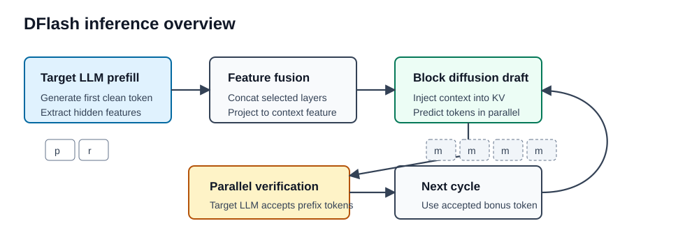
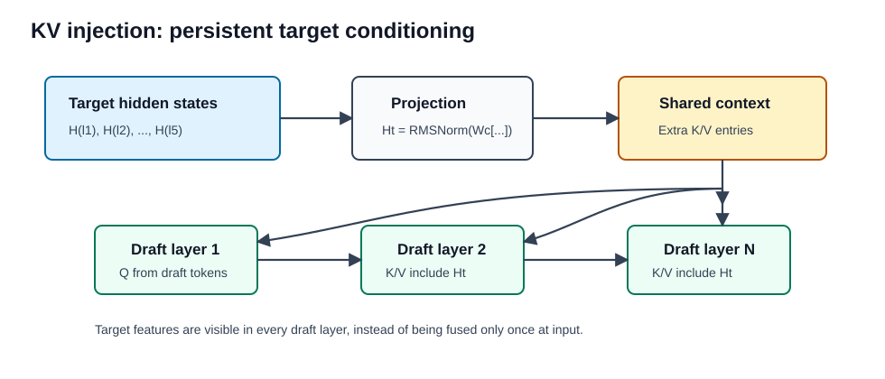
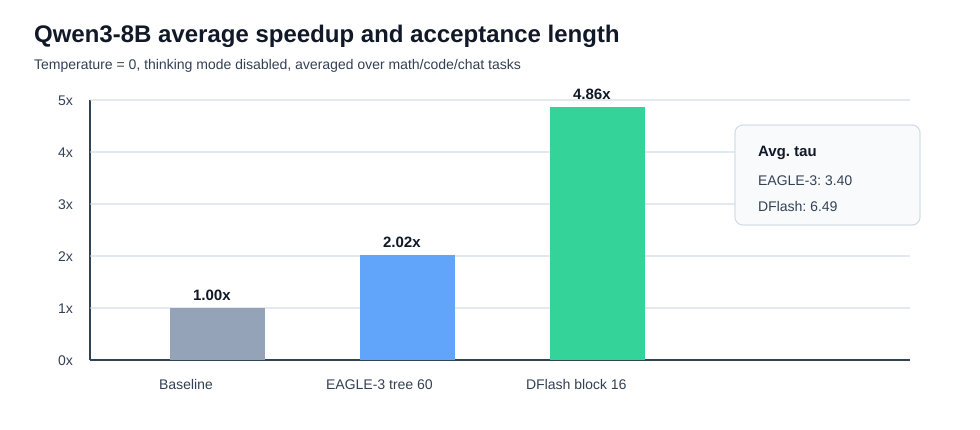

### Abstract

论文 **DFlash: Block Diffusion for Flash Speculative Decoding** 提出了一种基于 block diffusion 的 speculative decoding 框架。

传统 autoregressive LLM 需要逐 token 解码，推理延迟高、GPU 利用率低。Speculative decoding 通过 draft model 先生成候选 token，再由 target model 并行验证，从而实现无损加速。但 EAGLE-3 等方法的 draft 阶段本身仍然是 autoregressive，生成候选 token 时依旧需要串行执行，因此 draft cost 会随着候选 token 数线性增长。

DFlash 的核心想法是：**让一个轻量 block diffusion model 负责并行生成 draft tokens，再由高质量 autoregressive target model 负责验证**。这样既利用了 diffusion model 的并行生成能力，又避免了 diffusion LLM 单独生成质量不足的问题。

论文报告 DFlash 在多种模型和任务上能达到超过 $6\times$ 的 lossless acceleration，并且相比 EAGLE-3 最高有约 $2.5\times$ 的额外加速。

### Motivation

Speculative decoding 的平均 token latency 可以写成：

$$
L = \frac{T_{draft} + T_{verify}}{\tau}
$$

其中：

- $T_{draft}$：draft model 生成候选 token 的耗时
- $T_{verify}$：target model 并行验证候选 token 的耗时
- $\tau$：每轮平均接受 token 数，包括 target model 额外给出的 bonus token

因此，要提升 speculative decoding 的速度，本质上只有两个方向：

- 降低 $T_{draft}$
- 提高 $\tau$

Autoregressive drafter 的问题在于生成 $\gamma$ 个 draft tokens 需要 $\gamma$ 次顺序前向：

$$
T_{draft} = \gamma \cdot t_{step}
$$

这使得 draft budget 越大，draft cost 越高。为了控制延迟，EAGLE-3 这类方法通常只能使用非常浅的 draft model，例如单层 transformer。浅模型质量有限，acceptance length 很快饱和，所以实际 speedup 往往被限制在 $2-3\times$。

Diffusion drafter 则可以在一次 forward 中并行生成一个 token block：

$$
T_{draft} = t_{parallel}
$$

在中等 block size 下，$T_{draft}$ 对 $\gamma$ 不再线性敏感。这让 DFlash 可以使用更深、更有表达能力的 draft model，同时保持较低 draft latency。

### Method

#### Context Feature from Target Model

DFlash 的一个关键观察是：**target model knows best**。

大型 autoregressive LLM 的 hidden states 不只是当前 token 的表征，其中也隐含了多个 future tokens 的预测信息。DFlash 利用这一点，把 target model 的 hidden features 提供给 diffusion drafter，避免让小模型从零开始预测未来 token。

具体流程：

1. target model 先执行标准 prefill，并生成第一个 token；
2. 从 target model 中均匀采样若干层 hidden states；
3. 将这些 hidden states concat 后通过一个轻量 projection layer；
4. 得到 compact target context feature；
5. 用这个 feature condition draft model。

论文默认从 target model 的 5 个 layer 中抽取 hidden features。

#### KV Injection

直接把 target features 和 draft token embeddings 拼在输入层，只能在浅层提供信息。随着 draft model 层数增加，target feature 会逐渐被稀释。

DFlash 采用更强的 conditioning 方式：**把 target context feature 注入每一层 draft model 的 Key 和 Value 中**。

设融合后的 target feature 为：

$$
H_t = RMSNorm(W_c[H^{(l_1)}; ... ; H^{(l_5)}])
$$

在 draft model 第 $i$ 层中：

$$
Q_i = W_i^Q H_d
$$

$$
K_i = [W_i^K H_t; W_i^K H_d]_{seq}
$$

$$
V_i = [W_i^V H_t; W_i^V H_d]_{seq}
$$

也就是说，draft tokens 产生 query，而 target features 和 draft tokens 一起提供 key/value。target features 不经过 draft model 的 query projection、output projection、self-attention update 和 FFN，只作为每层都可见的额外上下文。

这个设计让 target model 的信息持续作用在 draft model 的每一层，因此 acceptance length 能随着 draft model 深度增加而提升。

#### Parallel Diffusion Drafting

DFlash 使用 block-level diffusion process 来生成 draft tokens。每轮 decoding 中，target model 验证通过的 bonus token 作为 clean anchor token，draft model 在其后放置一组 mask tokens，并一次性并行预测整个 block。

相比 autoregressive drafter 逐步生成 token，DFlash 的 block diffusion drafter 具有两个优势：

- draft 阶段 GPU 并行度更高；
- 可以使用更深的 draft model，而 draft latency 仍然较低。

### Training

DFlash draft model 训练时 target model 冻结，只训练 draft transformer layers。token embedding 和 LM head 与 target model 共享并保持 frozen，使 draft model 更像一个轻量 diffusion adapter。

训练样本由 prompt 和 target model 生成的 response 构成。对每条 response，DFlash 随机采样 anchor tokens，并把每个 anchor 后面的一个 block 构造成 masked block。模型需要根据 clean anchor token、masked positions 以及 target hidden features 并行预测后续 tokens。

这种训练方式比标准 block diffusion 更贴近 inference 场景，因为推理时每轮 draft 也总是从一个 target model 已确认的 clean token 开始。

#### Sparse Attention Mask

训练时多个 masked blocks 会被拼接到同一个 sequence 中。为了避免信息泄漏：

- 同一个 block 内可以 bidirectional attention；
- 不同 blocks 之间不能互相 attend；
- 每个 block 可以 attend 到对应的 target context features。

这样可以在一次 forward/backward 中高效训练多个 block。

#### Loss Weighting

在 speculative decoding 中，block 内越靠前的 token 越重要。因为如果第一个 token 被 target model 拒绝，后续 token 即使正确也不会被接受。

因此 DFlash 对 block 内位置使用指数衰减权重：

$$
w_k = exp\left(-\frac{k-1}{\gamma}\right)
$$

其中 $k$ 是 token 在 block 内的位置，$\gamma$ 控制衰减速度。这个 loss weighting 会更强调早期 token 的预测准确率，从而提升 acceptance length。

### Experiments

#### Main Results

论文在 Qwen3-4B、Qwen3-8B、Qwen3-Coder-30B-A3B、LLaMA-3.1-8B-Instruct 等模型上评估 DFlash，任务包括：

- Math：GSM8K、MATH-500、AIME25
- Code：HumanEval、MBPP、LiveCodeBench
- Chat：MT-Bench、Alpaca

在 Qwen3-8B、temperature = 0、thinking mode disabled 的设置下：

| Method | Avg. Speedup | Avg. Acceptance Length |
| --- | ---: | ---: |
| EAGLE-3, tree size 16 | $1.76\times$ | 2.96 |
| EAGLE-3, tree size 60 | $2.02\times$ | 3.40 |
| DFlash, block size 16 | $4.86\times$ | 6.49 |

可以看到，DFlash 不仅 speedup 更高，acceptance length 也明显高于 EAGLE-3。

在 temperature = 1 的采样场景下，DFlash 仍然保持约 $4.03\times$ 平均加速，而 EAGLE-3 tree size 60 约为 $1.88\times$。

#### Reasoning Models

thinking mode enabled 时，DFlash 对 Qwen3 reasoning models 仍然有效。Qwen3-8B 在 GPQA、MATH-500、AIME25 上：

| Temperature | GPQA | MATH-500 | AIME25 |
| --- | ---: | ---: | ---: |
| 0 | $4.17\times$ | $4.64\times$ | $4.51\times$ |
| 1 | $3.75\times$ | $4.03\times$ | $3.70\times$ |

这说明 DFlash 对长 reasoning trace 的推理加速尤其有价值。

#### Serving Framework

论文也在 SGLang 上测试了实际 serving throughput。以 Qwen3-8B、B200、FlashAttention-4 backend 为例：

| Task | Concurrency | Baseline | DFlash | Speedup |
| --- | ---: | ---: | ---: | ---: |
| Math500 | 1 | 230 tok/s | 1175 tok/s | $5.1\times$ |
| Math500 | 8 | 1666 tok/s | 7485 tok/s | $4.5\times$ |
| HumanEval | 1 | 229 tok/s | 955 tok/s | $4.2\times$ |
| HumanEval | 8 | 1649 tok/s | 6010 tok/s | $3.6\times$ |

高并发下 speedup 会下降，因为 verification 和 batch scheduling 的成本变得更重要，但 DFlash 仍然保持明显吞吐收益。

### Ablation

#### Draft Layers

DFlash 的 acceptance length 会随 draft model 层数增加而上升，但 draft latency 也会增加。论文比较了 3-layer、5-layer、8-layer draft model。

5-layer 是较好的 trade-off：

| Setting | Math500 Speedup / $\tau$ | HumanEval Speedup / $\tau$ | MT-Bench Speedup / $\tau$ |
| --- | ---: | ---: | ---: |
| 3-L | $4.69\times$ / 5.64 | $3.90\times$ / 4.61 | $2.38\times$ / 3.18 |
| 5-L | $4.71\times$ / 5.99 | $3.96\times$ / 4.94 | $2.35\times$ / 3.37 |
| 8-L | $4.64\times$ / 6.33 | $3.96\times$ / 5.29 | $2.23\times$ / 3.50 |

8-layer 的 acceptance length 更高，但整体 speedup 不一定更高。

#### Number of Target Hidden Features

更多 target hidden features 会提升 draft quality。3-layer draft model 中：

| Target Features | Math500 | HumanEval | MT-Bench |
| --- | ---: | ---: | ---: |
| 3-H | $4.49\times$ / 5.38 | $3.80\times$ / 4.47 | $2.32\times$ / 3.07 |
| 5-H | $4.69\times$ / 5.64 | $3.90\times$ / 4.61 | $2.38\times$ / 3.18 |

代价是训练时缓存 hidden states 的存储成本随 feature 数量线性增长。

#### KV Injection vs Input Fusion

KV injection 比 input fusion 更有效。对于 block-diffusion drafting：

| Variant | Injection | GSM8K | HumanEval | MT-Bench |
| --- | --- | ---: | ---: | ---: |
| DFlash | Input | 3.5 / $2.9\times$ | 3.5 / $2.9\times$ | 2.6 / $2.0\times$ |
| DFlash | KV | 4.2 / $3.3\times$ | 4.0 / $3.2\times$ | 3.0 / $2.2\times$ |

这说明 target feature 持续注入每层，比只在输入层融合更强。

### Key Insights

DFlash 最重要的 insight 是：**diffusion LLM 不一定要直接挑战 autoregressive LLM 的最终生成质量，它可以作为 speculative decoding 中的高并行 drafter。**

这个定位非常自然：

- diffusion model 负责快；
- target autoregressive model 负责准；
- speculative verification 保证最终输出 lossless；
- target hidden features 弥补小 diffusion drafter 的建模能力不足。

因此，DFlash 不是单纯提出一个更快的 diffusion language model，而是重新安排了 diffusion model 在 LLM inference pipeline 中的位置。

### Limitations

这篇论文也有一些需要留意的地方：

- draft model 需要针对 target model 训练，不能直接通用于所有模型；
- 训练依赖 target model 生成的数据和 hidden features；
- speedup 依赖 serving backend、batch size、concurrency、block size、verification cost；
- 与 DiffuSpec、SpecDiff-2 等 diffusion speculative decoding 方法没有直接复现对比，论文解释原因是相关实现缺乏开源；
- block size 的选择仍然是 trade-off，大 block 提高 acceptance potential，但 verification cost 也会变高。

### Takeaways

DFlash 给 speculative decoding 提供了一个很有启发性的方向：不再让 draft model 逐 token 生成，而是让它并行预测一个 token block。

从系统角度看，DFlash 的加速来自两个互补设计：

- block diffusion 降低 $T_{draft}$；
- target feature KV injection 提高 $\tau$。

这恰好对应 speculative decoding latency 公式中的两个核心变量。也正因为如此，DFlash 的结果比单纯换一个更小 drafter 或者更大 tree size 更有说服力。

我觉得这篇最值得借鉴的地方不是某个具体数字，而是它对 diffusion model 的重新定位：**当 diffusion LLM 单独生成还不够强时，可以让它成为 autoregressive LLM 的并行草稿器。**
