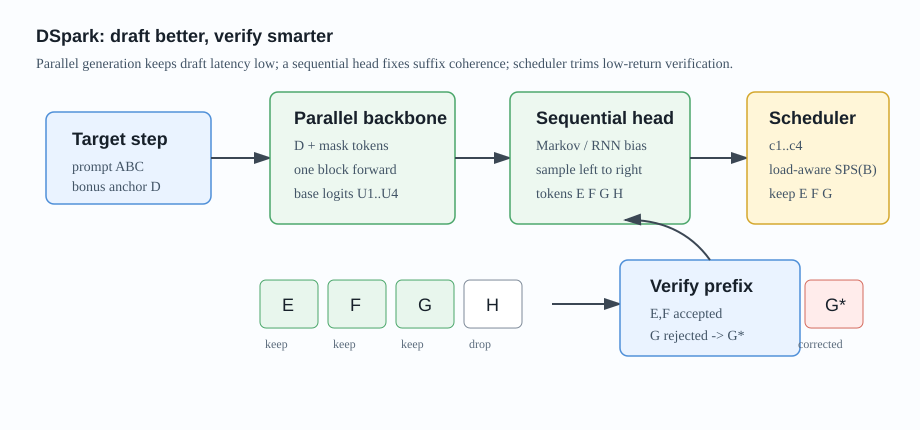
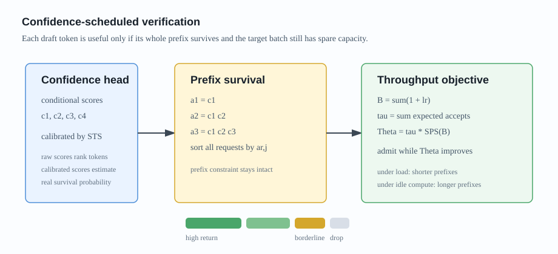
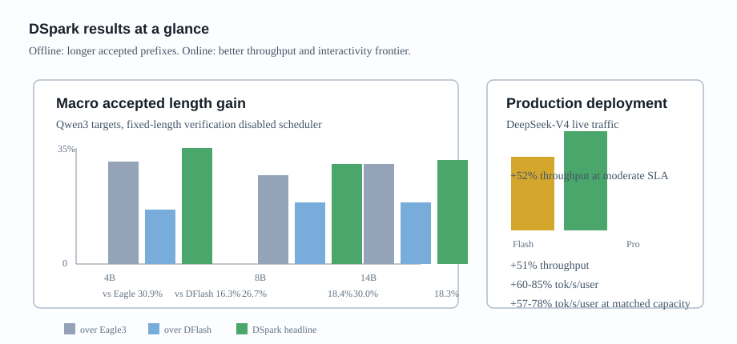

### Abstract

论文 **DSpark: Confidence-Scheduled Speculative Decoding with Semi-Autoregressive Generation** 研究的是 speculative decoding 在真实高并发 serving 场景里的两个瓶颈：draft token 质量和 target verification 浪费。

DFlash 这类 parallel drafter 可以一次 forward 生成一整个 block，draft latency 很低；但 block 内每个位置基本独立预测，后缀 token 容易出现 acceptance decay。另一方面，即使 parallel drafter 能便宜地产生长 block，也不代表 target model 应该把所有 token 都拿去验证。高并发时，验证低置信 suffix 会占用宝贵 batch capacity，反而损害总吞吐。

DSpark 的核心想法是：**draft 阶段用半自回归结构补上 block 内依赖，verification 阶段用置信度和硬件吞吐曲线动态决定每个请求该验证多长的 prefix**。

论文报告 DSpark 在离线 benchmark 上，相比 Eagle3 和 DFlash 都有更高 accepted length；在 DeepSeek-V4 线上 serving 系统中，相比生产 baseline MTP-1，在相同吞吐水平下让单用户生成速度提升约 $60\%-85\%$（V4-Flash）和 $57\%-78\%$（V4-Pro）。

### Motivation

Speculative decoding 的 per-token latency 可以写成：

$$
L = \frac{T_{draft} + T_{verify}}{\tau}
$$

其中：

- $T_{draft}$：draft model 生成候选 token 的耗时；
- $T_{verify}$：target model 并行验证候选 token 的耗时；
- $\tau$：每轮平均接受 token 数，包括 target model 额外给出的 bonus token。

因此加速有三条路：

- draft 更快，降低 $T_{draft}$；
- draft 更准，提高 $\tau$；
- verification 更聪明，降低有效 $T_{verify}$。

Autoregressive drafter，例如 Eagle3，能显式让后一个 draft token 依赖前面已经采样出的 token，所以 suffix coherence 好；但生成 $\gamma$ 个 token 要串行执行，draft cost 会随 $\gamma$ 增长。

Parallel drafter，例如 DFlash，则把整个 block 一次性预测出来。它的优势是 $T_{draft}$ 对 block size 不敏感，可以使用更深的 draft backbone；问题是每个位置独立地对所有可能前缀做 marginalization。当上下文存在多个合理 continuation，比如 “of course” 和 “no problem”，parallel drafter 可能拼出 “of problem” 这种跨 mode 的后缀，导致越往后 acceptance 越差。

DSpark 要解决的就是这个折中：

- 不想回到昂贵的 fully autoregressive drafting；
- 也不想让 pure parallel drafting 的后缀质量掉得太快；
- 更不想在 serving 高负载下盲目验证低价值 token。

### Method

#### Semi-Autoregressive Generation

DSpark 把 draft generation 分成两个阶段。

第一阶段是 parallel backbone。论文默认以 DFlash 作为 backbone，一次 forward 生成 block 内所有位置的 hidden states 和 base logits：

$$
h_1,\ldots,h_\gamma,\quad U_1,\ldots,U_\gamma
$$

第二阶段是 lightweight sequential head。它不是重新跑一个完整 transformer，而是在每个位置的 base logits 上加一个 prefix-dependent transition bias：

$$
p_k(v \mid x_0, x_{<k}) =
\frac{\exp(U_k(v) + B_k(x_0, x_{<k}, v))}
{\sum_{u \in V}\exp(U_k(u) + B_k(x_0, x_{<k}, u))}
$$

这里 $x_0$ 是上一轮 target model 生成的 anchor token，$U_k$ 是 parallel backbone 给出的第 $k$ 个位置 logits，$B_k$ 是 sequential head 给出的修正项。

这个设计很像：先让并行模型给出“每个位置大概应该是什么”，再用一个很轻的自回归头保证这些 token 彼此接得上。

论文实现了两种 head：

- Markov head：只依赖前一个 token $x_{k-1}$，用低秩矩阵 $B=W_1W_2$ 近似 token transition bias，默认 rank $r=256$；
- RNN head：维护 block 内 recurrent state，能看到更长 prefix history，但实现复杂度更高。

实验中 RNN head 只在更长 proposal length 上带来小幅收益，所以 DSpark 默认使用 Markov head。

#### Confidence Head

只提升 draft quality 还不够。因为 speculative decoding 的 verification 必须按 prefix 接受，一旦第一个低质量 token 被拒绝，它后面的 token 再好也没用。

DSpark 给每个 draft position 输出一个 conditional confidence：

$$
c_k = P(\text{position } k \text{ survives} \mid \text{positions } <k \text{ accepted})
$$

实现上，confidence head 使用 backbone hidden state $h_k$ 和前一个 draft token 的 Markov embedding：

$$
c_k = \sigma(w^\top [h_k; W_1[x_{k-1}]])
$$

监督信号不是简单的 0/1 是否被接受，而是 target distribution 和 draft distribution 的 total variation distance：

$$
c_k^* = 1 - \frac{1}{2}\lVert p_k^d - p_k^t \rVert_1
$$

这个量刚好对应 speculative rejection sampling 中单步接受概率，所以它比 hard label 更直接。

不过 raw confidence 往往过度自信。DSpark 又引入 Sequential Temperature Scaling（STS）：按位置从左到右校准累计 prefix survival probability：

$$
a_k = \prod_{i \leq k} c_i
$$

这样 scheduler 使用的不是“看起来很高”的置信度，而是更接近真实经验接受率的 survival probability。

#### Hardware-Aware Prefix Scheduler

传统做法常用固定阈值：confidence 低于某个值就不验证。但真实 serving 系统里，验证一个额外 token 的成本不是固定的。

低并发时，GPU 可能还有空闲算力，多验证一点低置信 token 也没关系；高并发时，每个额外 verification token 都会挤占 target model batch capacity，低价值 token 应该被剪掉。

DSpark 把 verification length selection 写成系统吞吐最大化问题。对一个 batch 里的请求 $r$，第 $j$ 个 prefix token 的 survival probability 是：

$$
a_{r,j} = \prod_{i \leq j} c_{r,i}
$$

若每个请求选择验证长度 $\ell_r$，target forward 的 batch token 数为：

$$
B = \sum_{r=1}^{R}(1+\ell_r)
$$

期望 accepted tokens 为：

$$
\tau = \sum_{r=1}^{R}\left(1+\sum_{j=1}^{\ell_r} a_{r,j}\right)
$$

设 $SPS(B)$ 是引擎在 batch size 为 $B$ 时的 steps per second，那么 scheduler 最大化：

$$
\Theta = \tau \cdot SPS(B)
$$

因为 $a_{r,j}$ 随着 prefix 位置单调下降，scheduler 可以把所有请求的 prefix extension 按 $a_{r,j}$ 从高到低排序，然后沿着这个 greedy path 逐个加入 verification budget，只要 $\Theta$ 还在上升就继续。

论文还强调一个细节：speculative decoding 要保持 lossless，admission decision 不能偷看未来 token。理论算法中用 early stopping 保证 non-anticipating property；线上系统为了兼容 CUDA graph replay 和 Zero-Overhead Scheduling，则使用两步前的 historical prediction 来决定容量上限，再用当前真实 confidence 排序选择 top-$K$，把调度延迟藏进异步 pipeline。

### Training

训练时 target model 冻结，draft model 共享 target 的 token embedding 和 LM head，并且这两部分也保持 frozen。更新的只有：

- parallel backbone drafter；
- sequential head；
- confidence head。

训练样本来自 target response 中随机采样的多个 anchor positions，每个 anchor 后面构造 $\gamma$-token block。

总 loss 包括三项：

$$
\mathcal{L} =
\alpha_{ce}\mathcal{L}_{ce}
+ \alpha_{tv}\mathcal{L}_{tv}
+ \alpha_{conf}\mathcal{L}_{conf}
$$

默认权重为：

$$
\alpha_{ce}=0.1,\quad \alpha_{tv}=0.9,\quad \alpha_{conf}=1.0
$$

其中：

- $\mathcal{L}_{ce}$：训练 draft token 预测；
- $\mathcal{L}_{tv}$：最小化 draft distribution 和 target distribution 的 total variation distance；
- $\mathcal{L}_{conf}$：训练 confidence head 预测 soft acceptance label。

三项 loss 都使用位置衰减权重：

$$
w_k = \exp\left(-\frac{k-1}{\gamma}\right)
$$

这是因为 prefix verification 中前面的 token 更重要。第一个 token 一旦错了，后面的 token 都没有被接受的机会。

### Experiments

#### Offline Draft Quality

离线实验主要验证 draft quality，因此关闭 confidence scheduler，所有方法都使用固定 proposal length。

目标模型包括 Qwen3-4B、Qwen3-8B、Qwen3-14B 和 Gemma4-12B。比较对象是：

- Eagle3：autoregressive drafter；
- DFlash：parallel drafter；
- DSpark：semi-autoregressive drafter。

benchmark 覆盖 Math、Code 和 Chat：

- Math：GSM8K、MATH500、AIME25；
- Code：MBPP、HumanEval、LiveCodeBench；
- Chat：MT-Bench、Alpaca、Arena-Hard。

在 Qwen3-8B 上，accepted length 如下：

| Method | GSM8K | MATH | AIME25 | MBPP | HumanEval | LCB | MT-Bench | Alpaca | Arena-Hard |
| --- | ---: | ---: | ---: | ---: | ---: | ---: | ---: | ---: | ---: |
| Eagle3 | 5.30 | 4.77 | 3.91 | 3.96 | 4.33 | 4.17 | 2.66 | 2.54 | 2.54 |
| DFlash | 5.33 | 4.91 | 4.07 | 4.36 | 4.64 | 4.39 | 3.11 | 2.98 | 2.81 |
| DSpark | 6.17 | 5.78 | 5.01 | 5.16 | 5.52 | 5.17 | 3.72 | 3.58 | 3.21 |

在 Qwen3-4B、8B、14B 上，DSpark 相比 Eagle3 的 macro-average accepted length 分别提升 30.9%、26.7%、30.0%；相比 DFlash 分别提升 16.3%、18.4%、18.3%。

#### Why Parallel Can Beat Autoregression

论文里一个有意思的分析是 position-wise conditional acceptance。

直觉上，autoregressive drafter 应该更准，因为它能看到前面已经 draft 出来的 token。但实际 Table 1 中 DFlash 和 DSpark 往往超过 Eagle3。

原因是：第一个 draft position 非常关键。Parallel drafter 的 latency 不随 block size 线性增长，所以可以用更深的 network。它在 position 1 的准确率明显更高，比如 Qwen3-4B 上 Math 任务 DFlash 约 0.88，而 Eagle3 约 0.81；Chat 上 DFlash 约 0.72，而 Eagle3 约 0.53。

由于 speculative decoding 是 prefix survival，第一个 token 拒绝会直接杀掉整块，因此 position 1 的优势会被放大。

但 pure parallel drafter 的问题也很明显：越往后 suffix decay 越严重。Eagle3 在后面位置能保持甚至提升 conditional acceptance，而 DFlash 会下降。DSpark 的半自回归 head 试图把两边优点合起来：保留 parallel backbone 的高 position-1 capacity，同时补上后缀依赖。

#### Drafter Depth and Proposal Length

DSpark 的 2-layer 版本就能超过 5-layer DFlash，说明 lightweight sequential modeling 的参数效率很高。

当 proposal length 从 4、8、12 扩到 16 时，DSpark 相比 DFlash 的优势还会变大。论文报告在 $\gamma=7$ 时，DSpark 在 math/code/chat 上分别提升 accepted length 约 16%、15%、18%；到 $\gamma=15$ 时，提升扩大到 30%、26%、22%。

更关键的是，sequential head 的 latency overhead 很小。batch size 128、不同 context length 平均下，draft length 从 4 扩到 16，相比 DFlash 的整轮 latency 只增加约 0.2% 到 1.3%。

#### Confidence Head

论文用 confidence threshold sweep 诊断 confidence head 是否真的能剪掉低价值 suffix。

threshold 从 0 提高后，accepted tokens 数量下降，但 rejected tokens 下降得更明显，因此 overall acceptance rate 上升。尤其在 Chat 任务上，acceptance rate 从 45.7% 提升到 95.7%，说明 open-ended chat 中低置信 suffix 的浪费最严重。

校准方面，在 Alpaca reliability diagram 上，raw confidence 的 ROC-AUC 约为 0.81 到 0.90，但 ECE 有 3% 到 8%。经过 STS 后，平均 ECE 降到约 1%，更适合拿来估计 $\Theta = \tau \cdot SPS(B)$。

### Real-World Deployment

DSpark 被部署到 DeepSeek-V4-Flash preview 和 DeepSeek-V4-Pro preview 的线上 serving 系统中。线上版本 DSpark-5 使用最大 draft length $\gamma=5$，parallel backbone 是 3 个 MoE layers，sequential block 使用 Markov head。

生产 baseline 是 MTP-1。论文解释说，虽然可以做 MTP-3/5，但静态多 token drafter 在高并发下会因为 verification overhead 过大而降低总吞吐，所以此前生产上保留的是单 token setup。

在线上 live traffic 中，DSpark 的收益分两类。

第一类是中等 SLA 下的吞吐提升：

| Engine | SLA | DSpark Throughput Gain |
| --- | ---: | ---: |
| DeepSeek-V4-Flash | 80 tok/s/user | +51% |
| DeepSeek-V4-Pro | 35 tok/s/user | +52% |

第二类是严格 SLA 下的 frontier extension。比如 Flash 的 120 tok/s/user、Pro 的 50 tok/s/user，MTP-1 会接近系统边界，只能支撑很小并发；DSpark 仍然能维持有意义吞吐。论文给出的 nominal throughput gain 很大，Flash 为 661%，Pro 为 406%，但作者也提醒这更应该理解为 DSpark 解锁了原 baseline 难以稳定支持的 interactivity tier，而不是常规倍数加速。

在 matched practical throughput levels 下，更稳定的比较是：

- V4-Flash：单用户生成速度提升 $60\%-85\%$；
- V4-Pro：单用户生成速度提升 $57\%-78\%$。

### Takeaway

我觉得 DSpark 最有价值的点是它把 speculative decoding 从“算法平均加速”推进到了“生产系统调度”。

DFlash 解决了 draft latency 的问题，但长 block 的后缀质量和验证浪费仍然存在。DSpark 先用一个非常轻的 sequential head 修复 block 内 coherence，再用 calibrated confidence 和硬件吞吐曲线决定 verification budget。它不是固定地多 draft、多 verify，而是问一个更工程化的问题：

**当前这个 token，放进 target verification batch 里，是否还能提高系统级 expected throughput？**

这个视角很适合高并发 serving，因为系统瓶颈不只是单请求 latency，也包括 batch capacity、CUDA graph、scheduler latency、variable-length prefix routing 等实际约束。

### Limitation

DSpark 的 scheduler 能减少 target verification waste，但 draft-side cost 仍然固定存在。也就是说，即使某些请求天生 acceptance rate 很低，DSpark 仍然要先用 parallel backbone 生成初始 $\gamma$-token block。

论文也提到，未来可以做 difficulty-aware early exiting：对于明显困难、低接受率的请求，draft model 不必总是完整生成整块 token。这个方向如果做成，DSpark 的 load-aware 思想就会从 verification side 进一步扩展到 drafting side。
