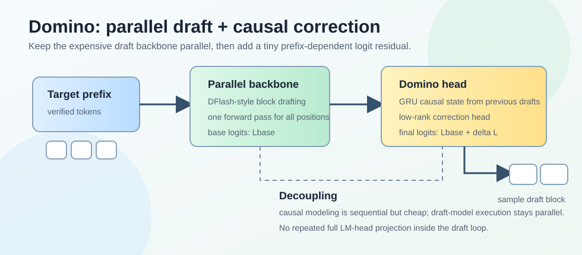
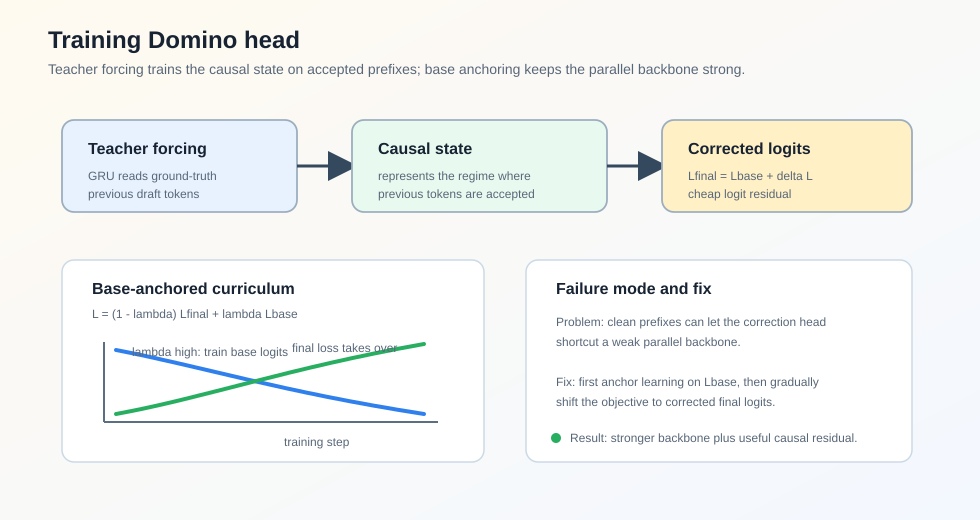
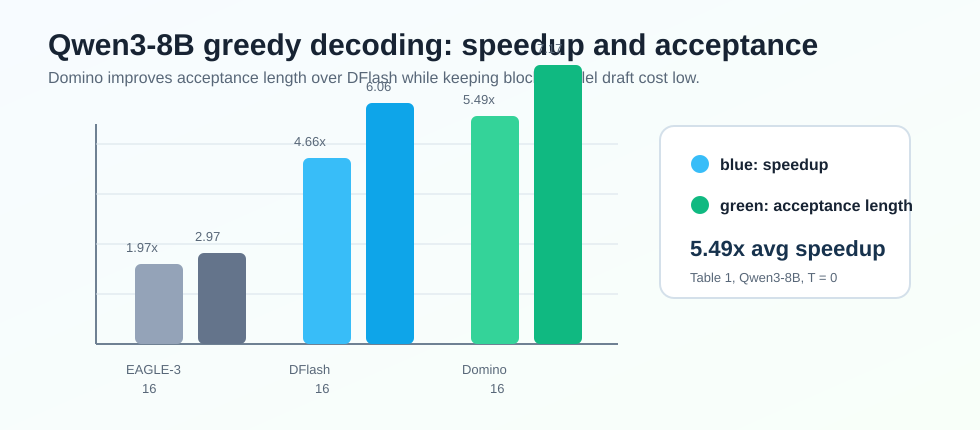

### Abstract

论文 **Domino: Decoupling Causal Modeling from Autoregressive Drafting in Speculative Decoding** 讨论的是 speculative decoding 中一个很核心的矛盾：**高质量 draft 往往需要因果依赖建模，但传统 autoregressive drafter 为了建模这些依赖，又必须串行生成 draft tokens，导致 draft cost 很高**。

EAGLE-3 这类 autoregressive drafter 能让后一个 draft token 看到前面已经生成的 draft tokens，所以 acceptance length 通常更好；但生成 $\gamma$ 个 draft tokens 需要 $\gamma$ 次 draft forward 和 LM head projection。DFlash 这类 parallel drafter 可以一次生成整个 block，draft cost 低很多，但 block 内 token 之间缺少显式因果依赖，draft quality 会受影响。

Domino 的核心想法是：**不要把因果依赖建模和昂贵的 autoregressive draft execution 绑定在一起**。它先用一个 parallel draft backbone 并行给出整块 draft logits，再用一个轻量 Domino head 根据前面已经采样出的 draft tokens 做 logit-space residual correction。

论文在 Qwen3-8B 上报告，Domino 在 Transformers backend 下 greedy decoding 平均达到 $5.49\times$ end-to-end speedup，高于 DFlash 的 $4.66\times$；在 SGLang serving 下也能带来最高约 $5.8\times$ throughput speedup。

### Motivation

Speculative decoding 的 per-token latency 可以写成：

$$
L_{spec} = \frac{T_{draft} + T_{verify}}{\tau}
$$

其中：

- $T_{draft}$：draft model 生成候选 tokens 的耗时；
- $T_{verify}$：target model 并行验证这些候选 tokens 的耗时；
- $\tau$：每轮平均推进的 token 数，也就是 average acceptance length，包括 target model 给出的 bonus token。

因此 speedup 可以写成：

$$
\eta = \frac{L_{target}}{L_{spec}} = \frac{\tau L_{target}}{T_{draft} + T_{verify}}
$$

这说明 speculative decoding 的最终速度由两个方向共同决定：

- 提高 $\tau$，让每次 target forward 接受更多 token；
- 降低 $T_{draft}$，避免 draft 阶段把验证节省下来的时间吃掉。

Autoregressive drafting 的优势是质量高。它建模的是：

$$
q_{AR}(x_{t+1:t+\gamma} \mid x_{\leq t}) =
\prod_{i=1}^{\gamma} q(x_{t+i} \mid x_{<t+i})
$$

每个未来 token 都能依赖前面已经 draft 出来的 token，所以更接近 target model 的 autoregressive 分布。但代价是：

$$
T^{AR}_{draft} \approx \gamma \cdot (t_{net} + t_{head})
$$

也就是说 draft budget 越大，draft cost 越高。

Parallel drafting 的优势刚好相反。它直接预测一个 block：

$$
q_{PAR}(x_{t+1:t+\gamma} \mid x_{\leq t})
$$

draft cost 近似为一次 block-level forward 和一次 block-level head projection：

$$
T^{PAR}_{draft} \approx t^{block}_{net} + t^{block}_{head}
$$

这类方法可以充分利用 GPU 并行能力，但 block 内 token 之间的因果依赖变弱。Domino 要解决的问题就是：**能不能保留 parallel drafting 的低成本，同时把 autoregressive drafting 中有用的因果依赖补回来？**

### Method

#### Parallel Draft Backbone

Domino 的 backbone 直接采用 DFlash 风格的 parallel draft backbone。给定已经被 target model 验证过的 prefix $x_{\leq t}$，Domino 使用最后一个 verified token $x_t$ 作为 anchor，然后构造一个 masked draft block：

$$
\tilde{x}_{t:t+B-1} = [x_t, [MASK], ..., [MASK]]
$$

backbone 接收两类输入：

- target model 从 verified prefix 中抽取的 context features $C_t$；
- masked draft block 的 token embeddings。

然后一次非 autoregressive forward 产生整个 block 的 hidden states：

$$
H_{t:t+B-1} = Backbone(C_t, Embed(\tilde{x}_{t:t+B-1}))
$$

未来位置的 preliminary logits 由 frozen target LM head 计算：

$$
L^{base}_i = LMHead(H_i), \quad i=t+1,...,t+B-1
$$

这一步和 DFlash 的精神一致：主干 draft computation 保持并行，避免重复调用 draft model。

#### Domino Head

Domino Head 是论文真正新增的部分。它由两个组件组成：

- causal encoder：用轻量 GRU 汇总当前 block 中前面已经 draft 出来的 tokens；
- low-rank correction head：把 causal state 和 backbone hidden state 结合，产生 logit-space residual correction。

对于第 $i$ 个 draft 位置，causal encoder 读取前面 token embeddings：

$$
S_{i-1} = GRU(E_{\leq i-1})
$$

其中 $S_{i-1}$ 表示当前位置能看到的 prefix-dependent 信息。论文实现中 GRU hidden dimension 为 1024。

然后 Domino head 用低秩瓶颈产生 correction logits：

$$
\Delta L_i = W_2 \sigma(W_1 [H_i; S_{i-1}])
$$

最终 draft logits 是：

$$
L_i = L^{base}_i + \Delta L_i
$$

这里的关键是：**correction 发生在 logit space，而不是 hidden space**。如果在 hidden space 做 correction，每次 causal update 后还要重新经过一次完整 LM head，等于又把昂贵的 full-vocabulary projection 放回串行路径里。Domino 只让 base LM head 在并行路径里算一次，串行 causal branch 只做低秩 residual correction。

### Training

#### Teacher-Forced Causal Encoding

Domino Head 的 causal encoder 需要读取前面的 draft tokens。训练时有两种选择：

- 像 EAGLE-3 的 training-time testing 一样，喂模型自己生成的 prefix；
- 使用 teacher forcing，直接喂 ground-truth prefix。

Domino 选择 teacher forcing。原因是 speculative verification 的机制决定了：第 $i$ 个 token 是否有意义，前提是前面 $1...i-1$ 个 draft tokens 已经全部被 target model 接受。也就是说，对 acceptance length 有贡献的位置，本来就处在“前缀正确”的 regime。

因此，与其训练 causal encoder 去处理大量 noisy self-generated prefixes，不如直接训练它在 ground-truth prefixes 上学习有用的 causal correction。

#### Base-Anchored Curriculum

Teacher forcing 也会带来一个副作用：由于 correction branch 训练时看到的是干净前缀，它可能直接 shortcut parallel backbone。这样 final logits 看起来能学好，但 base logits 变弱，backbone 本身没有真正学到强 base distribution。

Domino 用一个 base-anchored curriculum 解决这个问题：

$$
L = (1 - \lambda_t) L_{final} + \lambda_t L_{base}
$$

训练开始时 $\lambda_t = 1$，主要优化 base logits，强迫 parallel backbone 先学好；随后 $\lambda_t$ 线性退火到 0，把优化重心逐渐转移到 final logits，让 Domino head 接管 residual correction。

同时，论文沿用 block-level speculative decoding 中常见的位置衰减权重：

$$
w_k = exp(-k/\gamma)
$$

因为 block 越靠前的 token 越重要：如果第一个 token 被拒绝，后面的 token 即使预测正确也不会被接受。

### Runtime

Domino Head 虽然引入了一个 sequential correction loop，但它非常轻量。论文使用 fused Triton kernels 和 CUDA Graphs 减少 kernel launch 与 Python overhead。

在论文 Figure 1 的 latency setting 下，Domino Head 的 latency 从 $2.64ms$ 降到 $1.20ms$。相比 DFlash，Domino 增加约 56M 参数，即 $+5.3\%$，总 draft-then-verify latency 只增加约 $2.8\%$，但 average acceptance length 提升约 $16.6\%$。

### Experiments

#### Main Results

论文主要在 Qwen3-4B 和 Qwen3-8B 上评估，任务覆盖：

- Math：GSM8K、MATH-500、AIME25
- Code：HumanEval、MBPP、LiveCodeBench
- Chat：MT-Bench、Alpaca

训练数据使用 `mlabonne/open-perfectblend`，并用对应 target model 重新生成 responses。所有 Domino 实验默认 draft block size 为 16，parallel draft backbone 为 5 layers，GRU hidden size 为 1024，low-rank correction dimension 为 256。

在 Qwen3-8B、temperature = 0、Transformers backend 下：

| Method | Avg. Speedup | Avg. Acceptance Length |
| --- | ---: | ---: |
| EAGLE-3, tree size 16 | $1.97\times$ | 2.97 |
| EAGLE-3, tree size 60 | $2.26\times$ | 3.41 |
| DART, tree size 60 | $2.29\times$ | 2.82 |
| DFlash, block size 16 | $4.66\times$ | 6.06 |
| Domino, block size 16 | $5.49\times$ | 7.17 |

可以看到，Domino 相比 DFlash 的主要收益来自更高的 acceptance length：平均 $\tau$ 从 6.06 提升到 7.17，而 draft 阶段仍保持 parallel backbone 的低成本。

在 temperature = 1 的采样场景下，Qwen3-8B 的平均 speedup：

| Method | Avg. Speedup | Avg. Acceptance Length |
| --- | ---: | ---: |
| DFlash, block size 16 | $3.96\times$ | 5.18 |
| Domino, block size 16 | $4.46\times$ | 5.91 |

这说明 Domino 的 causal correction 不只在 greedy decoding 有效，在 sampling decoding 下也能提升 draft quality。

#### Serving Throughput

论文也在 SGLang 中评估高并发 throughput。以 Qwen3-8B 为例：

| Task | Concurrency | Baseline TPS | DFlash | Domino |
| --- | ---: | ---: | ---: | ---: |
| GSM8K | 2 | 184 | $3.7\times$ | $5.1\times$ |
| GSM8K | 8 | 655 | $2.9\times$ | $4.1\times$ |
| GSM8K | 32 | 1713 | $1.6\times$ | $2.1\times$ |
| MBPP | 2 | 183 | $3.6\times$ | $3.8\times$ |
| MBPP | 8 | 635 | $3.0\times$ | $3.2\times$ |
| MBPP | 32 | 1428 | $2.0\times$ | $2.1\times$ |

高并发下 speedup 会下降，这是 serving 系统里常见现象：batching、verification 和 memory bandwidth 的影响会变强。但 Domino 仍然普遍高于 DFlash，说明 acceptance length 的提升能转化成实际 serving throughput。

### Ablation

#### Same-Data Comparison

为了排除训练数据差异，论文在 ShareGPT 上用相同 16-token draft budget 训练多个 baseline。结果显示三类方法的 trade-off 很清楚：

- EAGLE-3 acceptance length 高，但串行 draft overhead 大；
- DFlash draft overhead 低，但 acceptance length 较低；
- Domino 在 acceptance length 和 draft cost 之间取得更好平衡。

例如在 GSM8K 上：

| Method | Avg. Acceptance Length | Concurrency 1 | Concurrency 8 | Concurrency 32 |
| --- | ---: | ---: | ---: | ---: |
| EAGLE-3 | 5.01 | $2.35\times$ | $1.77\times$ | $0.97\times$ |
| DFlash | 3.90 | $2.68\times$ | $1.95\times$ | $1.09\times$ |
| Domino | 4.65 | $3.01\times$ | $2.18\times$ | $1.24\times$ |

EAGLE-3 在高并发时甚至可能低于 baseline，因为 sequential draft cost 被放大；Domino 的 acceptance length 虽然不一定超过 EAGLE-3，但因为 draft 路径更轻，整体吞吐更好。

#### Training Strategy

训练策略 ablation 有两个结论：

| Strategy | Avg. Acceptance Length |
| --- | ---: |
| Training-time testing | 3.80 |
| Teacher forcing | 3.96 |
| Teacher forcing + curriculum | 4.19 |

Teacher forcing 比 TTT 更好，说明 causal encoder 应该专注于“前缀已经正确”的 accepted-prefix regime。Curriculum 进一步提升，是因为它避免 correction branch 过早 shortcut backbone。

#### Domino Head

论文直接关闭 Domino Head 做 ablation：

| Method | Avg. Acceptance Length | Avg. Speedup |
| --- | ---: | ---: |
| w/o Domino Head | 3.49 | $2.84\times$ |
| w/ Domino Head | 4.19 | $3.31\times$ |

这说明提升不是单纯来自 DFlash backbone 或训练设置，而是来自 prefix-dependent causal correction 本身。

### Takeaway

Domino 的贡献可以概括成一句话：**把因果依赖建模从昂贵的 autoregressive draft execution 里拆出来，放进一个轻量的 logit correction branch 中**。

它和 DFlash 的关系也很清楚：

- DFlash 证明 block-parallel drafting 可以大幅降低 $T_{draft}$；
- Domino 在 DFlash 的基础上补回 block 内因果依赖，提高 $\tau$；
- 最终 speedup 来自更好的 $\tau / (T_{draft}+T_{verify})$ trade-off。

我认为这篇论文最有价值的点不是 GRU 或 low-rank head 本身，而是它给 speculative decoding 提供了一个很实用的设计原则：**不要为了建模依赖就把整个 draft model 拉回串行执行；只让必要的依赖路径串行，并且让它足够轻**。

### Limitation

论文也提到几个限制：

- Domino 主要解决 inference acceleration，不降低训练或 finetuning 成本；
- 当前实现主要适配 SGLang，其他 serving framework 还需要系统评估；
- 实际 speedup 与硬件平台相关，memory bandwidth、compute capability 和 kernel efficiency 都会影响收益。

因此 Domino 更像是一个很强的 speculative decoding system design，而不是可以无条件迁移到所有部署环境的纯算法改进。
