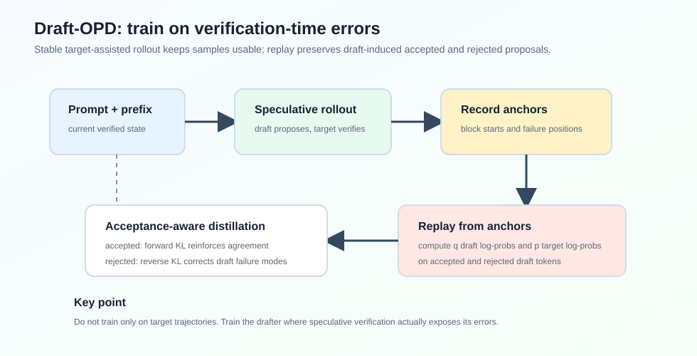
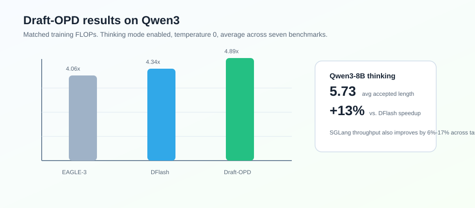

### Abstract

论文 **Draft-OPD: On-Policy Distillation for Speculative Draft Models** 关注 speculative decoding 中 draft model 的训练问题。

EAGLE-3、DFlash 这类训练式 draft model 通常用 target model 生成的离线轨迹做 SFT。论文观察到：SFT 很快会遇到 accepted length plateau，继续训练也不提升。原因是训练和推理的状态分布不一致：SFT 看到的是 target-generated trajectories，而 speculative decoding 真正评估的是 drafter 自己提出的 token block。

Draft-OPD 的核心想法是：**让 target model 在 drafter 自己暴露错误的位置上监督 drafter**。它用 target-assisted rollout 保证样本稳定，同时记录 speculative verification 暴露出来的 anchor/error positions，再从这些位置 replay draft，计算 target 和 draft 的 log-prob，最后用 acceptance-aware distillation objective 训练。

论文在 Qwen3 系列上报告，Draft-OPD 在 thinking mode 下能达到超过 $5\times$ lossless acceleration，相比 EAGLE-3 和 DFlash 在 matched FLOPs 下分别提升约 23% 和 13%。

### Motivation

Speculative decoding 的速度高度依赖 draft model 和 target model 的对齐程度。对齐越好，每轮 verification 能接受的 token 越多，average acceptance length $\tau$ 越高。

传统 SFT 训练 draft model 时，训练数据通常是 target model 生成的固定轨迹。也就是说，训练状态来自：

$$
s_t = (x, y_{<t}^{target})
$$

但在 speculative decoding 推理时，target model 验证的是 drafter 自己提出的 block。accepted length 实际由 draft-induced states 决定：

$$
s_t = (x, \hat{y}_{<t}^{draft})
$$

这就是论文所说的 offline-to-inference mismatch。

自然的想法是用 on-policy distillation，让 student 在自己访问到的状态上接受 teacher 监督。但直接套 OPD 到 draft model 上又有两个问题：

- draft-only rollout 不稳定：EAGLE/DFlash-style draft modules 不是完整 autoregressive generator，强行自回归 rollout 容易重复或退化；
- naive target-assisted rollout 会丢掉 on-policy signal：target model 会修正错误 token，最终轨迹又变成 target distribution。

Draft-OPD 要同时满足两个条件：rollout 质量稳定，并且保留 draft model 在 verification 中暴露出的错误。

### Method

#### Rollout with Error-Position Collection

给定 prompt $x$，Draft-OPD 用正常 speculative decoding 做 rollout。每一轮中，draft model $q_\phi$ 在当前 verified prefix 后提出 $K$ 个 token：

$$
d_m = (d_{m,1}, ..., d_{m,K}) \sim q_\phi(\cdot \mid x, y_{\leq a_m})
$$

target model $p_\theta$ 并行验证这个 block。如果接受了 $r_m$ 个 token，下一个 anchor 移到 $a_m + r_m$。

关键是：Draft-OPD 不只保留最终 verified rollout，还记录每个 block 的起点 anchor $a_m$。这些 anchor 标记了 drafter 在推理时真实采取行动的位置。

#### Replay for Log-Probability Computation

收集完 rollout 和 anchors 后，Draft-OPD 从每个 anchor 重新 replay drafting。对于 anchor $a_m$，上下文是：

$$
c_m = (x, y_{\leq a_m})
$$

然后在 draft-generated prefix 上同时计算 draft 和 target 对每个 draft token 的 log-prob：

$$
\log q_{m,k}(d_{m,k}) = \log q_\phi(d_{m,k} \mid c_m, d_{m,<k})
$$

$$
\log p_{m,k}(d_{m,k}) = \log p_\theta(d_{m,k} \mid c_m, d_{m,<k})
$$

这一步和普通 SFT 的区别很大：它不是在 final rollout token 上训练，而是在 draft model 提出过的 tokens 上训练，包括被 verification 拒绝的位置。

#### Acceptance-Aware Distillation

verification 会把 draft tokens 分成 accepted 和 rejected 两类：

$$
I_{acc} = \{(m,k): 1 \leq k \leq r_m\}
$$

$$
I_{rej} = \{(m,k): r_m < k \leq K\}
$$

论文对两类 token 使用不同 KL 方向：

- accepted tokens：用 forward KL，强化 draft 与 target 已经比较接近的区域；
- rejected tokens：用 reverse KL，惩罚 draft 自己高置信但 target 不认可的模式。

对于 rejected tokens，论文还加了位置衰减：

$$
w_k = \gamma^{k-1}
$$

因为 speculative decoding 中越靠前的错误越重要。一个 block 的第一个 token 错了，后面的 suffix 再好也不会被接受。

最终目标是：

$$
L_{Draft-OPD} =
\frac{\lambda_{acc}L_{acc} + \lambda_{rej}L_{rej}}
{\lambda_{acc}+\lambda_{rej}}
$$

实验中 $\lambda_{acc}=\lambda_{rej}=1$。

### Experiments

论文在 Qwen3-4B、Qwen3-8B、Qwen3-30B-A3B-Thinking 上实验，任务包括 GSM8K、MATH-500、AIME25、MBPP、HumanEval、SWE-bench Lite、MT-Bench。

在 Qwen3-8B、thinking mode enabled、temperature = 0 下：

| Method | Mean Speedup | Avg. Acceptance Length |
| --- | ---: | ---: |
| EAGLE-3 | $4.06\times$ | 5.64 |
| DFlash | $4.34\times$ | 5.19 |
| Draft-OPD | $4.89\times$ | 5.73 |

在 thinking mode disabled、temperature = 0 下，Qwen3-8B 的平均 speedup：

| Method | Mean Speedup | Avg. Acceptance Length |
| --- | ---: | ---: |
| EAGLE-3 | $4.63\times$ | 5.99 |
| DFlash | $5.11\times$ | 6.04 |
| Draft-OPD | $5.60\times$ | 6.57 |

这说明 Draft-OPD 不是只对长 reasoning traces 有效，在普通非 thinking generation 中也能继续提升 draft-target alignment。

### Serving

论文也在 SGLang + FA3 backend 下验证了部署收益。Draft-OPD 相比 DFlash 在 Qwen3-4B、Qwen3-8B、Qwen3-30B-A3B-Thinking 的 AIME25、MATH-500、SWE-Lite 上普遍提升 throughput。

一个有意思的点是：高并发下收益没有消失。论文报告在 concurrency = 32 时，平均相对增益甚至高于 concurrency = 1。这说明 acceptance length 的提升能转化为实际 serving throughput，而不只是单机低并发 benchmark 数字。

### Ablation

论文做了几个关键 ablation：

| Variant | MATH-500 | HumanEval | MT-Bench |
| --- | ---: | ---: | ---: |
| Draft-OPD | $5.55\times$ / 6.57 | $5.17\times$ / 6.18 | $3.18\times$ / 4.44 |
| w/o weight decay | $5.13\times$ / 6.18 | $4.96\times$ / 6.01 | $3.07\times$ / 4.29 |
| all-reverse KL | $5.11\times$ / 6.14 | $4.94\times$ / 5.98 | $3.08\times$ / 4.33 |
| all-forward KL | $5.34\times$ / 6.35 | $5.01\times$ / 6.09 | $3.09\times$ / 4.33 |
| random anchors | $5.04\times$ / 6.08 | $4.99\times$ / 6.07 | $2.96\times$ / 4.24 |

这里能看到三点：

- mixed KL 比单一 KL 方向更好；
- rejected-token position decay 有用；
- error-position anchors 比 random anchors 更有效。

### Takeaway

Draft-OPD 的核心价值不在于换了一个 draft architecture，而在于指出 draft model 后训练应该对准 speculative decoding 真正失败的位置。

可以把它和 DFlash/Domino 放在一条线上看：

- DFlash 降低 draft cost；
- Domino 在 parallel drafting 上补 causality；
- Draft-OPD 则从训练分布上补齐 draft-induced errors。

我觉得这篇最值得记住的一句话是：**draft model 不应该只学习 target model 已经走过的正确轨迹，还应该学习自己在 verification 中为什么失败。**

### Limitation

论文也提到几个限制：

- thinking-mode OPD 训练时最大 response length 是 4096，而评估用 8192，长生成后段状态覆盖不足；
- 主要实验集中在 Qwen3 和 DFlash-style draft architecture；
- Draft-OPD 保持 lossless decoding，只提升效率，不提升 target model 的生成质量。
