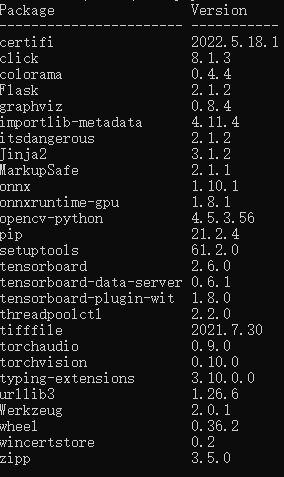

### Installation

#### virtual environments

​	We recommend using the latest version of Python. Flask supports Python 3.7 and newer.


1. conda create -n flask python=3.7
2. activate flask
3. jupyter notebook .


#### dependencies

1. pip list



2. description
   - [Werkzeug](https://palletsprojects.com/p/werkzeug/) implements WSGI, the standard Python interface between applications and servers.
   - [Jinja](https://palletsprojects.com/p/jinja/) is a template language that renders the pages your application serves.
   - [MarkupSafe](https://palletsprojects.com/p/markupsafe/) comes with Jinja. It escapes untrusted input when rendering templates to avoid injection attacks.
   - [ItsDangerous](https://palletsprojects.com/p/itsdangerous/) securely signs data to ensure its integrity. This is used to protect Flask’s session cookie.
   - [Click](https://palletsprojects.com/p/click/) is a framework for writing command line applications. It provides the `flask` command and allows adding custom management commands.

3. A Minimal Application

   ```python
   from flask import Flask
   
   app = Flask(__name__)
   
   @app.route("/")
   def hello_world():
       return "<p>Hello, World!</p>"
   
   ```

   - CMD

     ```
     set FLASK_APP=hello
     flask run
     * Running on http://127.0.0.1:5000/
     ```

   - Application Discovery Behavior

     Now head over to http://127.0.0.1:5000/, and you should see your hello world greeting.

   - Address 

