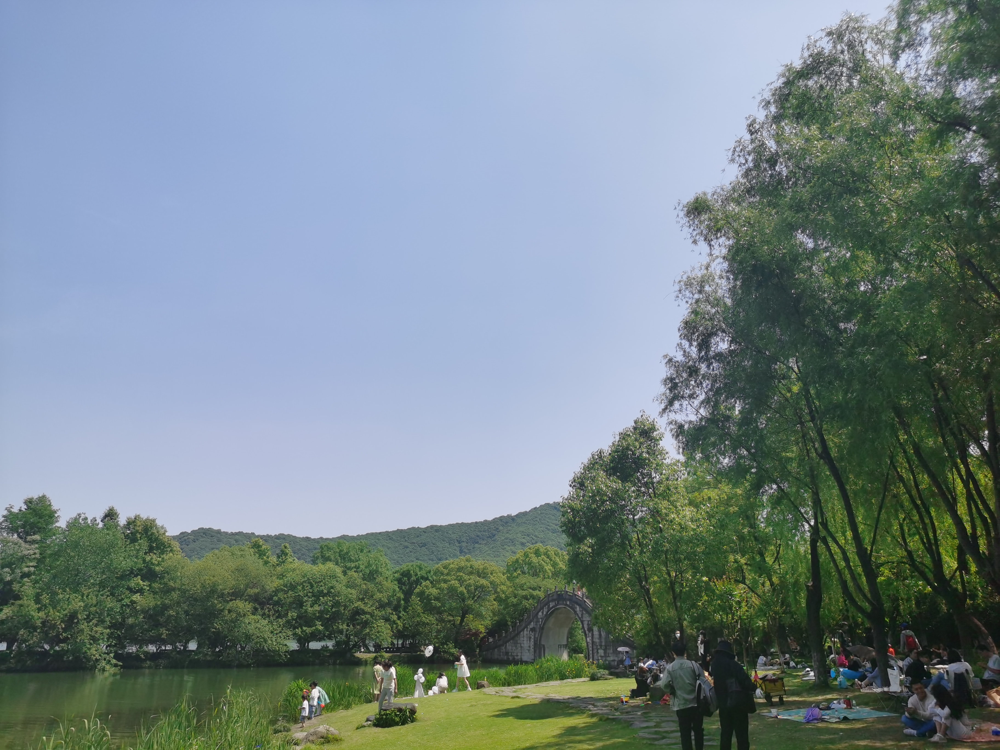

### 
湘湖篇

五一假期过半，前些天宅在家里看书、做饭（确实辛苦，我妈太不容易了）、欣赏火老师的斯诺克世锦赛，唯独没有出去沐浴阳光。遂与华兄相约，至湘湖畔，踏春阅览。

湘湖地图总览，区域狭长，在我的故乡并不多见，家乡小溪居多，却没有小湖泊。

中间走累了，在一个小坡上停下看看风景，随手拍了一张，看着像sigmoid曲线。

露营的人们，好羡慕这些享有天伦之乐的爸爸、妈妈、孩子们。

这里好像有圈养的黑天鹅（想起了杭研所的那几只傻鹅，挺凶的），似乎是高傲的贵族。

此乃大花金鸡菊，好鲜活的黄色。

这里看，感觉手机拍照功能还是加了些算法的，用科技弥补了自己的拍照技术。

桥如其名，有四个亭子，桥下有个公交站，就叫四亭桥站，快走累了，我们也准备回去了。

一路上和华兄聊了很多，男人之间啥都可以聊，最后谈到要是自己的自行车出行（湘湖不在哈啰运营区），那应该也挺有乐趣，我想我们都会有机会的。
