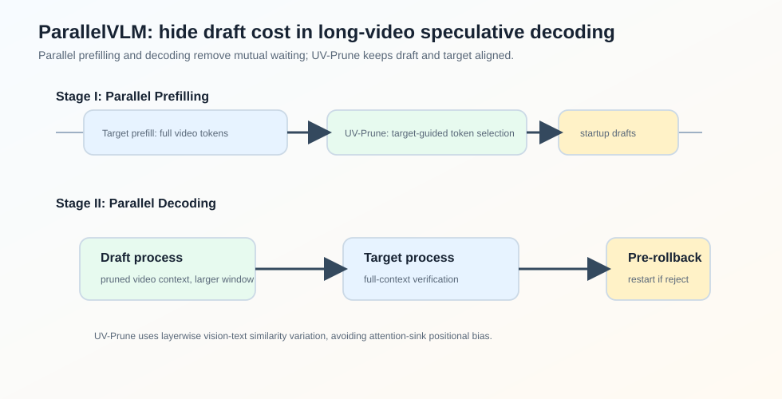
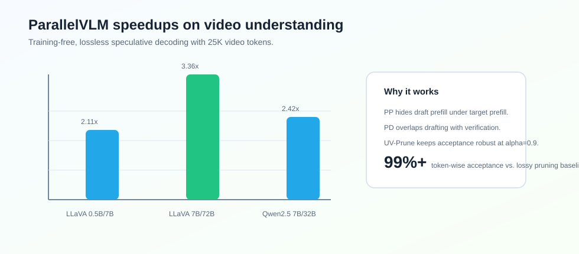

### Abstract

论文 **ParallelVLM: Lossless Video-LLM Acceleration with Visual Alignment Aware Parallel Speculative Decoding** 研究的是 Video-LLM 的无损推理加速。

Video-LLM 的特殊问题是 video tokens 很长，prefill 和 decoding 都很重。直接做 visual token pruning 虽然能加速，但会改变 target model 的输入分布，带来信息损失。Speculative decoding 是 lossless 的，但传统 SD 在 Video-LLM 上有两个瓶颈：draft 和 target 的 prefill/decoding 串行等待，以及 pruned draft context 和 full target context 的对齐问题。

ParallelVLM 的核心思路是：**把 draft 和 target 的 prefill、decoding 都做成 pipeline parallel，同时用 target model 早层的 vision-text alignment variation 指导 draft-side video token pruning**。

论文报告 ParallelVLM 在 LLaVA-OneVision-72B 上平均达到 $3.36\times$ 加速，在 Qwen2.5-VL-32B 上达到 $2.42\times$ 加速，并保持 lossless speculative verification。

### Motivation

Video-LLM 的输入通常是大量 video tokens 加少量 text tokens。以 LLaVA-OneVision 为例，论文实验中 128 帧视频会产生：

$$
196 \times 128 = 25088
$$

个 video tokens。

这让两个阶段都很重：

- prefill：target model 需要为完整 video context 建 KV cache；
- decoding：每步仍要在长 context 上 autoregressive decoding。

传统 speculative decoding 在 Video-LLM 上有两个问题。

#### Sequential Execution Bottleneck

vanilla SD 中 draft prefill、target prefill、draft decoding、target verification 都按顺序发生。对于长视频，draft prefill 本身已经很重。

论文举例：24K video tokens 下，LLaVA-OV-72B target prefill 约 44.23s，7B draft prefill 约 7.92s。这个 draft prefill 在传统流程中就是额外等待。

decoding 阶段也类似。若 draft decoding time $T_q = 78ms$，target verification time $T_p = 420ms$，窗口 $\gamma=5$，一轮约为：

$$
\gamma T_q + T_p \approx 2T_p
$$

硬件在 draft 和 verify 的交替中出现大量 idle time。

#### Speed Ratio vs. Alignment

video tokens 有冗余，所以可以 pruning draft model 的 visual tokens，提高：

$$
c = \frac{T_p}{T_q}
$$

但 pruning 太激进会损害 draft-target alignment，导致 acceptance rate 下降。

SpecVLM 用 target attention score 指导 pruning，但论文指出 attention-guided pruning 有 positional bias：attention 容易集中在视频开头、结尾或靠近 query 的位置，而不一定是对任务真正重要的中间帧。

### Method

#### UV-Prune

ParallelVLM 不问“模型 attention 到哪些 token”，而问：

**哪些 video tokens 在 target model 的层间传播中越来越对 text query 对齐？**

对于第 $i$ 个 video token $V_i$ 和第 $j$ 个 text token $X_j$，定义 vision-text similarity：

$$
S_{ij} = \frac{V_i \cdot X_j}{\|V_i\|\|X_j\|}
$$

然后计算 early layers 间的 similarity variation：

$$
\Delta S_i =
\sum_{j=1}^{n}\sum_{l=1}^{L}(S_{ij}^{l}-S_{ij}^{l-1})
$$

如果 $\Delta S_i$ 大，说明这个 video token 在 target model 层间变得更相关。UV-Prune 保留 Top-K：

$$
V^* = TopK(\Delta S_1, ..., \Delta S_m)
$$

这个信号来自 target model 自己，因此比纯 attention score 更像一种 verifier-guided alignment transfer，同时避免 attention-sink positional bias。

#### Parallel Prefilling

ParallelVLM 的 Stage I 同时启动两个进程：

$$
\begin{cases}
Draft: KV_q \leftarrow M_q(V^*, X_{1:n}) \\
Target: KV_p \leftarrow M_p(V_{1:m}, X_{1:n})
\end{cases}
$$

target process 对完整 video tokens prefill，draft process 在 pruned video tokens 上 prefill。由于 target prefill 很长，draft-side pruning、draft prefill、startup token generation 都可以隐藏在 target prefill 时间里。

Stage I 结束时：

- target model 有 full-context KV cache；
- draft model 有 pruned-context KV cache；
- 第一批 startup draft tokens 已经准备好，可以马上 verify。

#### Parallel Decoding

Stage II 中，draft 和 target 形成流水线。第 $i$ 轮里：

- draft model 生成下一窗口候选 tokens；
- target model 同时验证上一窗口候选 tokens。

如果 token 被拒绝，则执行 pre-rollback 和 restart drafting。

窗口大小由 pruned speed ratio 决定：

$$
\gamma = c^*(\alpha)=\frac{T_p}{T_q(\alpha)}
$$

论文例子中，LLaVA-OV-7B/72B 不 pruning 时 $c \approx 5$，$\alpha=0.9$ pruning 后 $c^* \approx 9$，所以窗口可以从 5 扩到 9。

### Experiments

论文在五个 video understanding benchmark 上评估：

- VideoDetailCaption
- VideoMME
- MVBench
- MVLU
- LongVideoBench

模型组合覆盖 LLaVA-OneVision 和 Qwen2.5-VL。

lossless SD 对比中，ParallelVLM 的平均 speedup：

| Model Pair | ParallelVLM Avg. Speedup | SpecVLM Avg. Speedup |
| --- | ---: | ---: |
| LLaVA-OV 0.5B / 7B | $2.11\times$ | $1.81\times$ |
| LLaVA-OV 7B / 72B | $3.36\times$ | $2.74\times$ |
| Qwen2.5-VL 7B / 32B | $2.42\times$ | $2.11\times$ |
| LLaVA-OV 7B / 7B | $1.55\times$ | $1.22\times$ |
| Qwen2.5-VL 7B / 7B | $1.51\times$ | $1.21\times$ |

相比 lossy visual token pruning，ParallelVLM 的优势是 target model 仍然用 full context verification。论文中 FastV、SparseVLM、P-Drop、DyCoke 在 10% retention 下平均 token-wise acceptance/quality proxy 约 82%-91%，而 ParallelVLM 在 LLaVA-OV-72B 和 Qwen2.5-VL-32B 上分别约 99.1% 和 98.7%。

### Ablation

论文重点分析 pruning ratio $\alpha$。随着 $\alpha$ 增大，draft decoding 更快，speed ratio $c$ 提高：

| Model Pair | Target $T_p$ | Draft $T_q$, $\alpha=0$ | Draft $T_q$, $\alpha=0.9$ |
| --- | ---: | ---: | ---: |
| LLaVA-OV 7B/72B | 420 ms | 78.3 ms, $c=5$ | 46.6 ms, $c=9$ |
| Qwen2.5-VL 7B/32B | 203 ms | 63.7 ms, $c=3$ | 39.8 ms, $c=5$ |

但 $\alpha$ 不能无限增大。极端 pruning 会破坏 draft-target alignment，acceptance rate 下滑。论文认为 $\alpha=0.9$ 是较好的 trade-off。

### Takeaway

ParallelVLM 的贡献不是单一算法，而是一个 Video-LLM speculative decoding 的系统协同设计：

- 用 Parallel Prefilling 隐藏 draft prefill；
- 用 Parallel Decoding 消除 draft/verify mutual waiting；
- 用 UV-Prune 提高 draft speed ratio，同时尽量保持 alignment。

我觉得它最值得借鉴的是：Video-LLM 的 speculative decoding 不能只照搬 text LLM 的流程。video context 太长，prefill 和 pruning 必须一起进入系统设计。

### Limitation

论文方法依赖 draft/target 双进程调度、目标模型早层 representation 传递和 pruning pipeline，实现复杂度高于普通 SD。并且虽然 verification 是 lossless 的，draft-side pruning 的选择仍会影响 acceptance 和实际 speedup，需要针对不同 Video-LLM 和视频长度调参。
