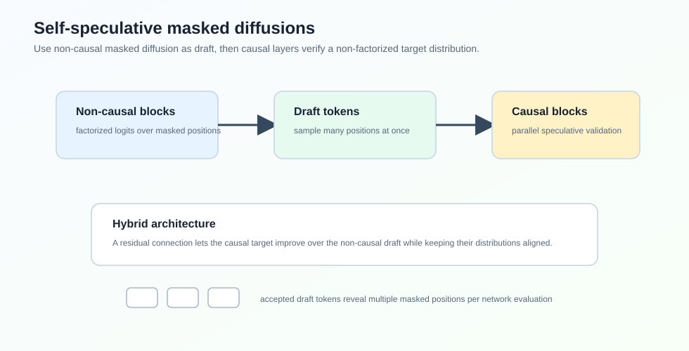
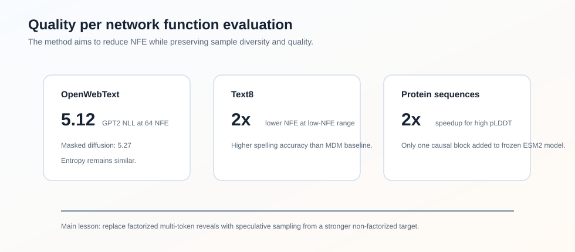

### Abstract

论文 **Self-Speculative Masked Diffusions** 提出了一类用于离散数据生成的 masked diffusion model，加速目标是减少生成一个样本所需的 network function evaluations，简称 NFE。

标准 masked diffusion model 每一步对所有 masked positions 输出 factorized logits，然后一次 reveal 若干 token。问题是：如果每步 reveal 太多 token，conditional independence approximation 会导致样本质量下降；如果 reveal 太少，又需要很多 forward passes。

这篇论文的核心想法是：**用同一个 hybrid transformer 同时产生 non-causal draft distribution 和 causal target distribution，然后用 speculative sampling 从更强的 non-factorized target distribution 中高效采样**。

论文在 GPT2-scale text modelling 和 protein sequence generation 上报告，相比标准 masked diffusion，在相同样本质量下大约减少 $2\times$ NFE。

### Motivation

Masked diffusion / any-order AR model 的生成过程可以理解成：给定一个 permutation $\sigma$，逐步 reveal 原本 masked 的 token。

标准 MDM 在当前已 reveal 的上下文 $x_{\sigma(1:i)}$ 下，用一个 non-causal transformer 输出 factorized distribution：

$$
\overleftrightarrow{p}_{\theta}(x_{\sigma(i+1:D)} \mid x_{\sigma(1:i)})
=
\prod_{d=i+1}^{D}
\overleftrightarrow{p}_{\theta}(x_{\sigma(d)} \mid x_{\sigma(1:i)})
$$

这个分布一次 forward 就能得到，但 token 之间被假设条件独立。如果一次 reveal 很多位置，样本质量会掉。

理想情况下，我们希望从 non-factorized causal distribution 采样：

$$
\overrightarrow{p}_{\phi}(x_{\sigma(i+1:D)} \mid x_{\sigma(1:i)})
=
\prod_{d=i+1}^{D}
\overrightarrow{p}_{\phi}(x_{\sigma(d)} \mid x_{\sigma(1:d-1)})
$$

它能建模未来 masked tokens 之间的依赖，但 naive autoregressive sampling 需要 $k$ 次 forward，计算成本又回来了。

因此论文的问题是：**能不能用 speculative sampling 的方式，用便宜的 factorized draft 去高效采样昂贵但高质量的 non-factorized target？**

### Method

#### Hybrid Non-Causal/Causal Transformer

论文设计了一个 hybrid architecture：

- 前面大部分 blocks 是 non-causal blocks，和标准 MDM 一样，用 any-to-any attention；
- 最后少量 blocks 是 causal blocks，沿 permutation $\sigma$ 做 causal attention；
- causal output 上加入 residual connection，把 non-causal hidden state 加回来。

non-causal blocks 参数化 draft distribution：

$$
\overleftrightarrow{p}_{\theta}
$$

causal blocks 参数化 target distribution：

$$
\overrightarrow{p}_{\theta,\phi}
$$

因为 causal blocks 在同一个 forward 中能看到 draft tokens 的排列上下文，所以它可以对 draft tokens 做 parallel validation。

#### Training Objective

训练时同时优化 non-causal 和 causal 两个分布：

$$
L = E\left[
\frac{D}{D-i}
\left(
\log \overleftrightarrow{p}_{\theta}(x_{\sigma(i+1:D)} \mid \theta(x_{\sigma(1:i)}))
+
\log \overrightarrow{p}_{\theta,\phi}(x_{\sigma(i+1:D)} \mid \theta(x_{\sigma(1:i)}), \phi)
\right)
\right]
$$

第一项等价于标准 MDM loss。第二项是随机顺序下的 autoregressive cross entropy。重要的是，两个 loss 可以在 hybrid network 的一次 forward 中一起算出来。

论文还指出，在标准设置下，这个 architecture 相比标准 transformer 只增加约 0.98% FLOPs。

#### Sampling

采样时，每一轮包含三步：

1. non-causal blocks 对所有 unknown positions 采样 draft tokens；
2. causal blocks 在 draft sequence 上计算 target probabilities；
3. 用 speculative sampling 的 accept/reject 规则接受若干 draft tokens，若拒绝则从 adjusted distribution 重采样。

接受概率是：

$$
\min\left(
1,
\frac{
\overrightarrow{p}_{\theta,\phi}(\hat{x}_{\sigma(d)} \mid \theta(x_{\sigma(1:i)}), \phi(\hat{x}_{\sigma(i+1:d-1)}))
}{
\overleftrightarrow{p}_{\theta}(\hat{x}_{\sigma(d)} \mid \theta(x_{\sigma(1:i)}))
}
\right)
$$

和普通 LLM speculative sampling 不同，这里的 target distribution 会随 generation trajectory 改变。因为 non-causal blocks 的输入会随着 reveal tokens 增加而变化，导致后续 causal target probabilities 也变化。论文为此给出了 likelihood decomposition 和 ELBO 分析。

### Experiments

#### Text8

论文先在 text8 上训练 150M 参数模型，包含 11 个 non-causal blocks 和 1 个 causal block。训练曲线显示：前期 causal loss 和 non-causal loss 几乎重合，之后 causal block 开始利用额外上下文，loss 明显低于 non-causal draft。

采样质量用 spelling accuracy 衡量。相比标准 masked diffusion，self-speculative 方法在低 NFE 区间能达到超过 $2\times$ 的 NFE reduction。

#### OpenWebText

OpenWebText 上使用 GPT2-scale 150M、12-layer transformer，前 11 层 non-causal，最后 1 层 causal。指标是 GPT2 generative perplexity，并用 unigram entropy 检查 diversity。

| Method | GPT2 NLL @ 32 NFE | GPT2 NLL @ 64 NFE | GPT2 NLL @ 128 NFE | Entropy @ 64 NFE |
| --- | ---: | ---: | ---: | ---: |
| Masked Diffusion | 5.50 | 5.27 | 5.13 | 5.70 |
| Speculative | 5.28 | 5.12 | 5.05 | 5.70 |
| No output residual | 5.36 | 5.16 | 5.10 | 5.70 |
| 10nc-2c layers | 5.34 | 5.16 | 5.06 | 5.68 |

可以看到，Speculative 在相同 NFE 下 NLL 更低，同时 entropy 和 baseline 接近，说明不是简单通过低温或 mode collapse 换来的。

#### Protein Sequence Modelling

蛋白序列实验基于 UniRef50。论文拿一个 pretrained 150M、30-layer ESM2-based masked diffusion model，冻结原模型，只加一个 causal block 并训练这个 head。

指标是 ESMFold 的 average pLDDT。结果显示 self-speculative 方法在高 pLDDT 区间相比标准 MDM 也能达到约 $2\times$ speedup。

### Ablation

论文两个 architecture ablation 很有意思：

- 去掉 output residual 会变差；
- 从 11 non-causal + 1 causal 改成 10 non-causal + 2 causal 也变差。

这说明最优点不是“causal blocks 越多越好”。在这里，non-causal draft distribution 要足够强，target distribution 只需要一个轻量 causal refinement。这个结论和 Domino 的“轻量 causal correction”有点呼应。

### Takeaway

这篇论文可以看作把 speculative sampling 从 LLM decoding 迁移到 masked diffusion sampling：

- 标准 MDM 的瓶颈是 factorized multi-token reveal；
- causal target 能给出 non-factorized distribution，但 naive sampling 太贵；
- self-speculative architecture 让 draft 和 target 共用大部分网络，在一次 forward 中完成 draft + verification。

我觉得最关键的设计是 residual connection：它让 causal target 在 non-causal draft 的基础上做改进，同时保持两者分布足够接近，从而提高 speculative acceptance。

### Limitation

论文主要报告 text 和 protein sequence，尚未证明在更复杂的大规模离散生成任务上都能稳定收益。另外，target distribution 随 generation trajectory 变化，使理论和实现都比标准 speculative sampling 更复杂。
