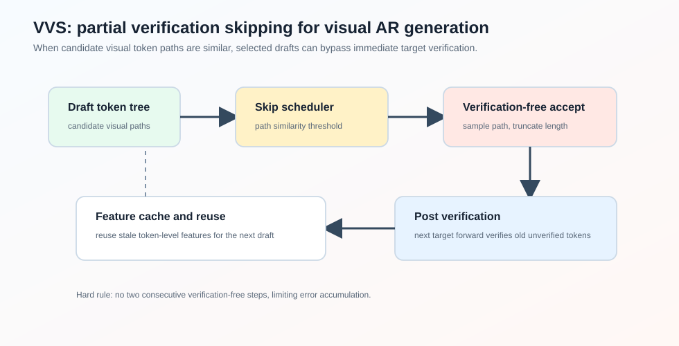
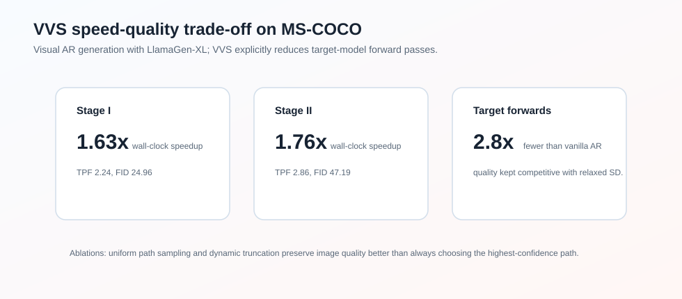

### Abstract

论文 **VVS: Accelerating Speculative Decoding for Visual Autoregressive Generation via Partial Verification Skipping** 研究 visual autoregressive generation 的 speculative decoding 加速。

传统 speculative decoding 是“draft one step, then verify one step”。这可以让 target model 一次 forward 接受多个 token，但每一轮仍然要调用 target model。对于图像 AR 生成，token 数很多，target forward 次数仍然是主要瓶颈。

VVS 的核心想法是：**在视觉 token 具有较强可互换性的前提下，部分 speculative decoding 轮次可以跳过 target verification，直接选择一个 draft token path，然后在下一次 target forward 中 post-verify 这些未验证 tokens**。

论文报告 VVS 能让 target model forward passes 相比 vanilla AR 减少约 $2.8\times$，在 MS-COCO 上达到最高 $1.76\times$ wall-clock speedup，并保持有竞争力的生成质量。

### Motivation

在 text LLM 中，speculative decoding 必须严格 verification，才能保证 target distribution 不变。但视觉 AR 生成有一个不同点：visual tokens 的语义往往更可互换。相邻或相似 codebook tokens 可能解码成视觉上接近的图像 patch。

已有视觉 AR speculative decoding 方法通常通过 relaxed acceptance 提升 acceptance rate，但仍然每轮都 verify。这样并没有显式减少 target model forward passes。

VVS 想进一步问：**是否可以跳过部分 verification？**

这会带来三个问题：

- 不 verify 时，该接受 draft tree 中哪条 token path？
- 不 verify 时，下一轮 draft 所需的 target hidden features 从哪里来？
- 跳过 verification 的步数如何调度，避免质量崩掉？

### Observations

#### Verification Redundancy

视觉 AR 的 draft model 会构造 candidate token tree。论文观察到，不同 candidate paths 往往视觉相似：约 75% 的 SD iterations 中，paths 的 cosine similarity 超过 0.7。

这说明 exhaustive verification 不一定总能带来视觉上明显不同的选择。论文进一步通过替换 target 选中的 token path 做实验，发现一定范围内替换 verification result 对图像质量不敏感。

这就是 verification redundancy。

#### Stale Feature Reusability

tree-based draft model 通常依赖 target verification 产生的 token-level features 来继续 draft。跳过 verification 后，这些新 features 会缺失。

论文观察到相邻 token features 相似度仍然较高，例如 adjacent tokens 的 feature similarity 约 0.68。因此可以缓存过去 verification 产生的 features，在 verification-free step 中复用 stale features。

更有意思的是，纯 stale features 会退化，但把 fresh features 和 stale features 混合使用效果更好，MAL maintainability 从 73% 提升到 85%。

### Method

#### Partial Verification-Skipping Pipeline

在第 $i$ 步启用 verification skipping 时，draft model 用缓存的 stale features $h_{i-1}$ 和上一轮选中的 token embeddings $e_{i-1}$ 生成候选 token tree。

VVS 直接从候选 token paths 中选出一个 path，得到未验证 continuation：

$$
x_i^\circ
$$

下一轮恢复 verification 时，VVS 会把旧的 unverified sequence $x_i^\circ$ 和新 drafted candidates 拼起来，一次送入 target model。论文称这个过程为 post verification。这样 target model forward 可以补回缺失的 KV-cache entries，并让 AR conditioning 回到正常状态。

为了防止错误累积，VVS 强制要求：**不能连续两步都跳过 verification**。

#### Token Selection with Dynamic Truncation

不 verify 时，最简单的做法是选择 draft tree 中 confidence 最高的 path。但 visual AR 的 draft tree 本身是 greedily constructed，固定选择最高 confidence 容易把生成过程推向 greedy fragments，损害图像多样性。

VVS 采用 uniform sampling，从 candidate paths 中随机选一个 path。然后做动态截断：

$$
\gamma = \min(L_s, \lfloor \bar{L} \rfloor)
$$

其中 $L_s$ 是选中 path 的长度，$\bar{L}$ 是 candidate paths 的平均长度。截断是为了避免长路径里后部低置信 token 大量绕过 verification。

#### Feature Cache and Reuse

VVS 会缓存每次 target verification 产生的 token-level features。跳过 verification 后，下一次 draft 需要 features 时，就从缓存中取最近的 features，数量匹配本轮 verification-free 接受的 token 数。

由于每轮 accepted length 不固定，取到的 features 可能来自多个历史 step，所以这是 mixed-staleness feature reuse。

#### Skipped-Step Scheduling

论文提出两种 skipping policy：

- uniform skipping：每隔固定间隔跳一次；
- dynamic skipping：根据 candidate token paths 的平均 similarity 决定是否跳过。

dynamic 策略计算：

$$
\bar{S} = \sum_{\ell=0}^{L-1} w_\ell S^{(\ell)}
$$

其中 $w_\ell$ 是指数衰减权重。若 $\bar{S}$ 高于阈值，说明 candidate paths 很相似，跳过 verification 风险较低。

### Experiments

论文在 LlamaGen-XL Stage I 和 Stage II 上，用 MS-COCO 2017 validation captions 生成图像。指标包括：

- speedup：wall-clock latency speedup；
- TPF：每次 target forward 生成的 token 数；
- quality：FID、CLIP score、Precision、Recall、HPSv2。

主结果如下：

| Model | Method | Wall-Clock Speedup | TPF | FID |
| --- | --- | ---: | ---: | ---: |
| Stage I | Vanilla AR | $1.00\times$ | 1.00 | 24.88 |
| Stage I | EAGLE-2 | $0.87\times$ | 1.22 | 25.28 |
| Stage I | LANTERN | $1.45\times$ | 2.10 | 24.97 |
| Stage I | VVS-U | $1.63\times$ | 2.24 | 24.96 |
| Stage II | Vanilla AR | $1.00\times$ | 1.00 | 48.23 |
| Stage II | EAGLE-2 | $0.92\times$ | 1.22 | 47.80 |
| Stage II | LANTERN | $1.26\times$ | 1.83 | 50.23 |
| Stage II | VVS-U | $1.76\times$ | 2.86 | 47.19 |

可以看到，在 Stage II 中 VVS 不仅 TPF 更高，FID 也优于 vanilla AR 和 LANTERN 的配置。

### Ablation

#### Token Selection and Truncation

论文比较了 confidence path selection 和 uniform sampling。结论是：两者 TPF 接近，但 uniform sampling 更能保持图像质量。

在 $\delta=0.1$ 时：

| Strategy | Truncation | TPF | FID |
| --- | --- | ---: | ---: |
| sampling | yes | 2.16 | 23.88 |
| confidence | no | 2.42 | 26.24 |
| confidence | yes | 2.16 | 24.71 |

不截断虽然更快，但 FID 明显变差。

#### Feature Staleness

feature reuse ablation：

| Feature Strategy | TPF | FID | CLIP |
| --- | ---: | ---: | ---: |
| stale only, $(0,0)$ | 2.23 | 32.63 | 0.3113 |
| fresh + older stale, $(-1,3)$ | 2.27 | 28.93 | 0.3152 |
| fresh + recent stale, $(-1,0)$ | 2.31 | 27.69 | 0.3179 |

fresh + recent stale 最好，说明 stale features 可用，但不能无限过期。

### Takeaway

VVS 不是传统意义上的 lossless speculative decoding。它利用视觉 token 的可互换性，在视觉质量可接受的范围内部分跳过 verification，从而真正减少 target model forward 次数。

我觉得它的关键洞察是：**视觉生成里的“正确 token”不是唯一的，很多 token path 在 perceptual space 中足够接近，因此 strict verification 可能存在冗余。**

这和 LLM speculative decoding 的哲学不同。LLM 更强调 preserving target distribution；VVS 更强调 speed-quality Pareto trade-off。

### Limitation

VVS 牺牲了严格 lossless guarantee，因此更适合视觉生成这类对 token-level exactness 不敏感的任务。对于文本生成或要求严格分布保持的任务，partial verification skipping 会很危险。另外，skipping threshold、relaxed acceptance threshold 和 feature staleness 都需要调参，部署时要根据模型和质量要求重新校准。
